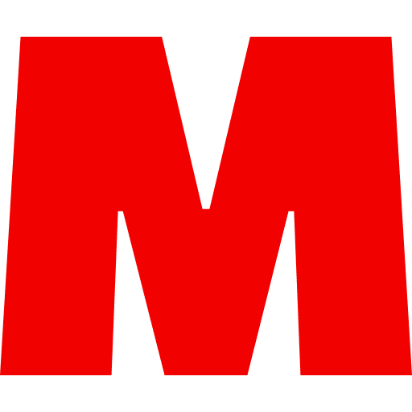
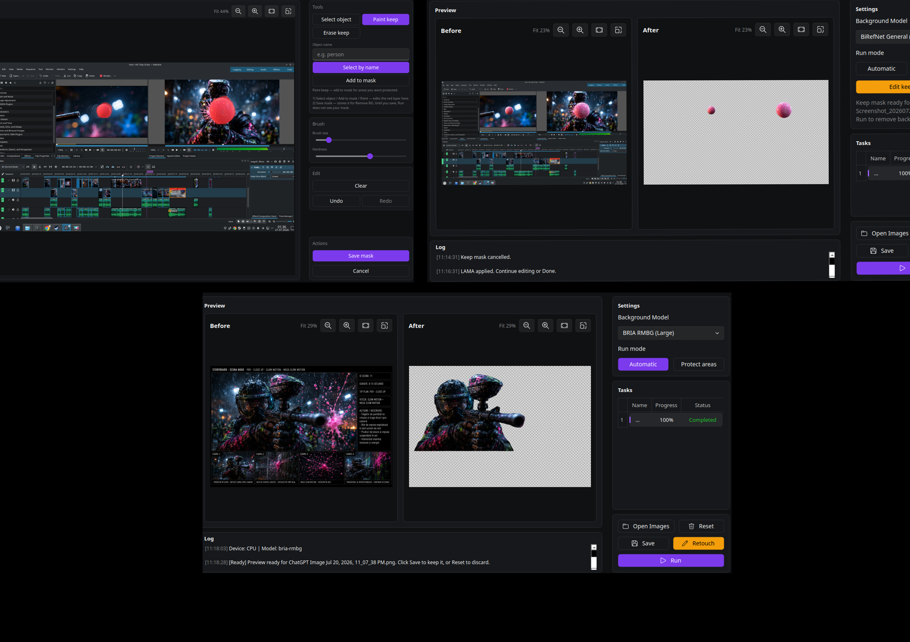

<p align="center">
  
</p>

<h1 align="center">Midgard</h1>

<p align="center">
  Local AI studio for remove text, remove background, upscale, low-light restore, object select, and image generation.<br/>
  No cloud API — runs on your machine and keeps original resolution.
</p>

<p align="center">
  
  
  
</p>

<p align="center">
  
</p>

---

## Quick start

```shell
# 1. Clone / copy the project (keep backend/models/)
# 2. Install (creates midgardEnv, picks CUDA or CPU, downloads default models)
python install.py

# 3. Run the GUI
./run_gui.sh          # Linux / macOS
run_gui.bat           # Windows
```

That is enough for most users. Models you need for Remove Text, Remove BG, Upscale ×2, Fix Low Light, and Select Object (fast) are installed or prefetched automatically.

---

## What Midgard can do

| Tool | Input | What it does |
|------|--------|----------------|
| **Remove Text** | Video + images | Strip hard subtitles and text watermarks with AI inpainting |
| **Remove BG** | Images | Cut out backgrounds (transparent PNG), protect mask, retouch, select object |
| **Image Upscale** | Images | Real-ESRGAN 2× / 4× (optional safe denoise) |
| **Fix Low Light** | Images | MIRNet restore for dark / underexposed photos |
| **Select Object** | Images | SAM2 + Grounding DINO — click or name an object for keep-mask editing |
| **Generate Image** | Prompt | FLUX.2 Klein text-to-image (CUDA GPU required) |
| **Settings** | — | OCR / STTN / ProPainter, model downloads, save dir, updates |

Everything runs locally. Video jobs keep the original audio when merge succeeds.

### Sample files (try these)

| File | Use for |
|------|---------|
| [`test/rm-bg.png`](test/rm-bg.png) | Present / demo Remove BG (UI + before/after cutouts) |
| [`test/scale-image.png`](test/scale-image.png) | Present / demo Image Upscale (Real-ESRGAN 2× + denoise) |
| [`test/test.mp4`](test/test.mp4) | Try Remove Text on video |

Open them from the GUI, or via CLI (see [Run](#run) below).

---

## Features in detail

### Remove Text (video + images)

- Draw one or more subtitle regions, or process full-frame text
- PP-OCRv5 detection: **Precise (Server)** / **Fast (Mobile)**
- Inpaint modes: **STTN Smart**, **STTN Detection**, **LaMa**, **ProPainter**, **OpenCV**
- Scene-aware processing, batch queue, before/after compare, A/B section marks
- Keeps source resolution and audio (when merge succeeds)

### Remove BG (images)

- **Automatic** cutout or **Protect areas** (paint regions to keep)
- **Edit keep mask**: Paint keep / Erase keep / **Select object**
- **Retouch** (brush / lasso / pen / rect + Apply LaMa)
- Multiple rembg ONNX models (BiRefNet, U2-Net, IS-Net, BRIA RMBG, …)
- Saves transparent PNG

### Image Upscale

- Real-ESRGAN **×2** (default) and **×4**
- Optional safe denoise before upscale
- Output capped at 5000 px long edge
- Try with [`test/scale-image.png`](test/scale-image.png) — open in **Image Upscale**, pick scale, then **Run**

### Fix Low Light

- MIRNet (LOL) for dark / low-light photos
- Images only; install weights from Settings if missing

### Select Object

- **Fast** pair: SAM2 Tiny + Grounding DINO Tiny (prefetched on install)
- **Complex** pair: SAM2 Large + DINO Base (optional, Settings)
- Click to segment, or select by name (“person”, …)

### Generate Image

- FLUX.2 Klein **4B** (~13 GB VRAM) and **9B** (~29 GB VRAM)
- NVIDIA CUDA only; install from **Settings → Generate Models**
- 9B may need a Hugging Face token (`config/hf_token`)

---

## Models used & download (DW)

Weights live under `backend/models/` (and rembg under `~/.u2net/`).  
**Core inpaint + OCR ship with the repo** (~1 GB). Split files are merged by `install.py` / first run.

### Shipped with the project (no extra download)

| Model | Path | Role | Best for |
|-------|------|------|----------|
| **STTN Auto** | `backend/models/sttn-auto/` | Default video/image inpaint | Live-action, ~4 GB+ VRAM |
| **STTN Det** | `backend/models/sttn-det/` | Detection-path inpaint | Video with detection path |
| **LaMa** | `backend/models/big-lama/` | Frame inpaint / retouch | Animation, flat color, lower VRAM |
| **ProPainter** | `backend/models/propainter/` | Motion video inpaint | Sports / strong motion; ~8 GB+ VRAM |
| **PP-OCRv5 Server** | `backend/models/V5/ch_det/` | Precise text detection | Better boxes |
| **PP-OCRv5 Mobile** | `backend/models/V5/ch_det_fast/` | Fast text detection | Speed |

**OpenCV** inpaint needs no weights (fast preview, lowest quality).

### Downloaded by installer (or Settings)

| Feature | Model | Local path | Download source |
|---------|-------|------------|-----------------|
| **Remove BG** | `birefnet-general`, `u2net_human_seg`, `isnet-anime`, `u2net_cloth_seg` (+ more in Settings) | `~/.u2net/*.onnx` | rembg sessions (GitHub/Hugging Face via rembg) |
| **Image Upscale** | `RealESRGAN_x2plus` (default), `RealESRGAN_x4plus` (optional) | `backend/models/realesrgan/` | [Real-ESRGAN releases](https://github.com/xinntao/Real-ESRGAN/releases) — [×2](https://github.com/xinntao/Real-ESRGAN/releases/download/v0.2.1/RealESRGAN_x2plus.pth) · [×4](https://github.com/xinntao/Real-ESRGAN/releases/download/v0.1.0/RealESRGAN_x4plus.pth) |
| **Fix Low Light** | `MIRNet_LOL` | `backend/models/mirnet/MIRNet_LOL.pth` | Google Drive ([swz30/MIRNet LOL weights](https://drive.google.com/uc?id=1t_FcBuMZD5th2KWVVNXYGJ7bMz5ZAWvF)) |
| **Select Object** | SAM2 Tiny + DINO Tiny (default); SAM2 Large + DINO Base (optional) | `backend/models/select_object/` | Hugging Face: [`facebook/sam2-hiera-tiny`](https://huggingface.co/facebook/sam2-hiera-tiny), [`facebook/sam2-hiera-large`](https://huggingface.co/facebook/sam2-hiera-large), [`IDEA-Research/grounding-dino-tiny`](https://huggingface.co/IDEA-Research/grounding-dino-tiny), [`IDEA-Research/grounding-dino-base`](https://huggingface.co/IDEA-Research/grounding-dino-base) |
| **Generate Image** | FLUX.2 Klein 4B / 9B | `backend/models/generate/` | Hugging Face: [`black-forest-labs/FLUX.2-klein-4B`](https://huggingface.co/black-forest-labs/FLUX.2-klein-4B), [`…/FLUX.2-klein-9B`](https://huggingface.co/black-forest-labs/FLUX.2-klein-9B) |

### Optional Remove BG models (Settings → Remove BG Models)

| Category | Models |
|----------|--------|
| General | BiRefNet General (default), Lite, Massive, IS-Net, U2-Net, U2-NetP, Silueta, BRIA RMBG |
| People | U2-Net Human, BiRefNet Portrait |
| Anime | IS-Net Anime |
| Clothes | U2-Net Cloth |
| Specialty | BiRefNet DIS / HRSOD / COD |

You can **Install / Uninstall / On–Off** each model in Settings. Uninstall only deletes local files — reinstall anytime.

---

## Requirements

- **Python 3.12** recommended (3.11–3.13 supported)
- **Windows 10/11**, macOS, or Linux
- Optional: NVIDIA GPU + current drivers for CUDA
- Network once for `pip` and optional model downloads
- Keep `backend/models/` with the project
- **Do not copy `midgardEnv/` between Linux and Windows** — recreate it per OS

---

## Install (easy)

### One command

```shell
python install.py
```

The installer will:

1. Prefer Python **3.12** (fallback 3.11 / 3.13)
2. Detect CUDA via `nvidia-smi` (default CUDA if found, else CPU)
3. Let you choose **CUDA / CPU**
4. Create `midgardEnv` and install Paddle, Torch, and `requirements.txt`
5. Verify / merge core inpaint + OCR weights
6. Prefetch default **Remove BG**, **Real-ESRGAN ×2**, **MIRNet**, and **Select Object (fast)** models
7. Write `run_gui.sh` (Linux/macOS) or `run_gui.bat` (Windows)

### Non-interactive

```shell
python install.py --yes
python install.py --mode cpu --yes
python install.py --mode cuda --yes
```

### CUDA wheel (auto from GPU series)

| Series | Examples | Preferred Torch wheel |
|--------|----------|------------------------|
| **1xxx** | GTX 1080, 1070 | `cu118` |
| **2xxx** | RTX 2080, 2060 | `cu118` |
| **3xxx** | RTX 3060, 3080 | `cu126` |
| **4xxx** | RTX 4090, 4070 | `cu128` |
| **5xxx** | RTX 5090, 5080 | `cu128` (required) |

Override: `python install.py --mode cuda --cuda-tag cu126 --yes`

Skip rembg prefetch (install later from Settings):

```shell
python install.py --skip-rembg-models --yes
```

### Windows 10 / 11

1. Install [Python 3.12](https://www.python.org/downloads/) with **Add python.exe to PATH**
2. Copy the Midgard folder (include `backend/models/`, exclude a Linux `midgardEnv/`)
3. In Command Prompt or PowerShell:

```bat
python install.py
run_gui.bat
```

For NVIDIA GPUs, install a current Game Ready / Studio driver first.

### Optional: Windows package (no Python for end users)

```bat
pip install QPT==1.0b8 setuptools
python backend\tools\makedist.py
```

CUDA examples: `makedist.py --cuda 11.8`, `--cuda 12.6`, `--cuda 12.8`, or `--directml`.  
Output is under `midgard_out/`.

---

## Run

### GUI

```shell
./run_gui.sh                        # Linux / macOS
run_gui.bat                         # Windows
# or:
midgardEnv/bin/python gui.py
midgardEnv\Scripts\python.exe gui.py
```

### CLI — Remove Text (video / image)

```shell
midgardEnv/bin/python backend/main.py -i test/test.mp4 -o output.mp4
midgardEnv\Scripts\python.exe backend\main.py -i test\test.mp4 -o output.mp4
```

```text
-t / --task remove-text                 (default)
-i / --input PATH
-o / --output PATH
-c / --subtitle-area-coords YMIN YMAX XMIN XMAX   (repeatable)
--inpaint-mode {sttn-auto,sttn-det,lama,propainter,opencv}
```

### CLI — Remove BG (images)

```shell
midgardEnv/bin/python backend/main.py -t remove-bg -i photo.jpg -o cutout.png
midgardEnv/bin/python backend/main.py -t remove-bg -i photo.jpg -o out.png --bg-model u2net_human_seg
midgardEnv/bin/python backend/main.py -t remove-bg -i anime.png -o out.png --bg-model isnet-anime
```

```text
-t / --task remove-bg
-i / --input PATH
-o / --output PATH                      (default: <stem>_nobg.png)
--bg-model {birefnet-general,u2net_human_seg,isnet-anime,...}
--protect-mask PATH                     (optional grayscale keep-mask)
```

> Upscale, Fix Low Light, Generate Image, and Select Object are GUI-only for now.

---

## Quick tips

| Goal | Suggestion |
|------|------------|
| Most live-action video | **STTN Smart Inpainting** |
| Anime / flat color | **LaMa** |
| Heavy camera motion | **ProPainter** (more VRAM) |
| Fast rough preview | **OpenCV** |
| Better OCR boxes | PP-OCRv5 **Precise (Server)** |
| General photo cutout | **BiRefNet General** |
| People cutout | **U2-Net Human** / BiRefNet Portrait |
| Dark photos | **Fix Low Light** (MIRNet) |
| Sharper crops / prints | **Image Upscale** ×2 or ×4 |
| Out of memory | Lower Max Concurrent Frames, use LaMa/OpenCV, or close other apps |
| CUDA install falls back to CPU | Drivers / `nvidia-smi` not available |

---

## License

See [LICENSE](LICENSE).
