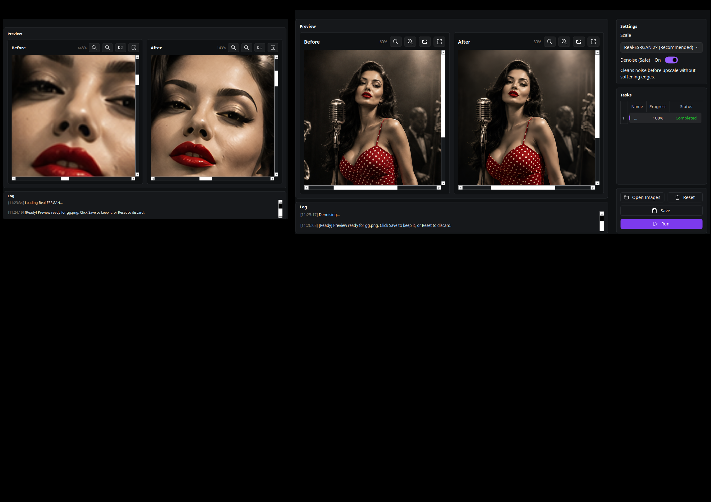
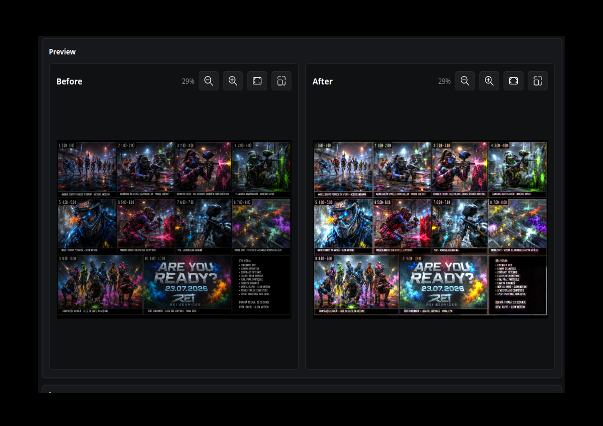

<p align="center">
  
</p>

<h1 align="center">Midgard</h1>

<p align="center">
  A local AI studio for image generation, text and subtitle removal, background
  removal, image upscaling, low-light restoration, and object-assisted masking.
</p>

<p align="center">
  
  
  
  
  
</p>

Midgard runs its processing locally. Your source media and generated output are
not sent to a Midgard cloud service. Internet access is needed only when
installing dependencies, downloading optional models, and checking for updates.

> [!NOTE]
> Midgard is currently distributed as a source installation. Windows, Linux,
> CUDA, DirectML, and Apple MPS paths are implemented, but not every
> hardware/platform combination has completed production certification. See
> [Platform notes](#platform-notes) and [Known limitations](#known-limitations).

## Features

| Tool | Input | What it does |
|---|---|---|
| **Generate Image** | Text prompt | Creates images with FLUX.2, SDXL Turbo, or Stable Diffusion 1.5. NVIDIA CUDA is required. |
| **Remove Text** | Video or image | Detects hard subtitles, captions, and text regions, then fills the masked area with an inpainting model. |
| **Remove BG** | Image | Produces a transparent PNG, with optional keep-mask painting, object selection, and local retouching. |
| **Image Upscale** | Image | Enlarges images by 2× or 4× with Real-ESRGAN and optional denoising. |
| **Fix Low Light** | Image | Restores dark or underexposed images with MIRNet. |
| **Select Object** | Image inside mask editors | Uses SAM2 and Grounding DINO to select an object by click or name. |
| **Model managers** | Optional model files | Installs, enables, disables, and removes models from Settings using one download queue. |

All long-running tools use a shared inference worker. Only one GPU-heavy job runs
at a time, preventing multiple features from competing for the same VRAM.

## Screenshots and sample files

The sample images in [`test/`](test/) can be opened directly in the matching
tool.

### Remove background

<p align="center">
  
</p>

### Upscale an image

<p align="center">
  
</p>

### Restore low light

<p align="center">
  
</p>

## Requirements

- A 64-bit Windows, Linux, or macOS computer
- **64-bit Python 3.12** (other Python minor versions are rejected)
- Git, if cloning or updating the repository with Git
- An internet connection during dependency and optional-model installation
- Enough free disk space for the selected models; generation models can require
  many gigabytes
- Current NVIDIA drivers for CUDA mode; the full NVIDIA CUDA Toolkit is not
  required

GPU acceleration is optional for most features. CPU mode is slower but is the
simplest compatible option. **Generate Image is the exception: it currently
requires a working NVIDIA CUDA GPU.**

## Installation

The installer creates an isolated `midgardEnv` environment inside the project,
installs the appropriate Torch, Paddle, and ONNX Runtime variants, verifies the
Python packages, checks bundled model chunks, and writes the launchers.

Run the installer separately on every computer. It selects dependencies for
that computer's GPU and driver: CUDA when a supported NVIDIA setup is detected,
or CPU when CUDA is unavailable. Do not copy `midgardEnv` between computers.

Clone the repository first:

```shell
git clone https://github.com/dexterR35/midgard.git
cd midgard
```

If you downloaded a ZIP instead, extract it and open a terminal in the extracted
`midgard` directory.

### Windows 10 or 11

1. Install [64-bit Python 3.12](https://www.python.org/downloads/) and enable
   **Add python.exe to PATH** during setup.
2. Install or update the NVIDIA display driver if you intend to use CUDA.
3. Open PowerShell or Command Prompt in the Midgard directory.
4. Run:

```bat
install.bat
run_gui.bat
```

The installer detects an NVIDIA GPU and asks whether to install CUDA or CPU
dependencies. For an unattended install:

```bat
install.bat --yes
```

Explicit Windows profiles:

```bat
install.bat --mode cuda --yes
install.bat --mode directml --yes
install.bat --mode cpu --yes
```

- Choose **CUDA** for a supported NVIDIA GPU.
- Choose **DirectML** to try Windows GPU acceleration without CUDA, including
  supported AMD or Intel GPUs.
- Choose **CPU** for maximum compatibility or troubleshooting.

### Linux

Install Python 3.12, its virtual-environment support, and Git with your
distribution's package manager. On Debian/Ubuntu systems where Python 3.12 is
available from the configured repositories, the packages are typically:

```shell
sudo apt update
sudo apt install python3.12 python3.12-venv git
```

Then install and launch Midgard:

```shell
chmod +x install.sh run_gui.sh
./install.sh
./run_gui.sh
```

For a headless or unattended install:

```shell
./install.sh --yes
```

Explicit Linux profiles:

```shell
./install.sh --mode cuda --yes
./install.sh --mode cpu --yes
```

CUDA mode requires a working NVIDIA driver and `nvidia-smi`. The installer
selects compatible Python wheels; do not install the full CUDA Toolkit solely
for Midgard.

If the GUI cannot start because a system library is missing, install the Qt/X11
runtime libraries provided by your Linux distribution. Package names differ
between distributions and desktop environments.

### macOS

Install Python 3.12 and Git. With Homebrew:

```shell
brew install python@3.12 git
```

Then:

```shell
chmod +x install.sh run_gui.sh
./install.sh
./run_gui.sh
```

On macOS, automatic mode selects **MPS**. You can also choose a profile
explicitly:

```shell
./install.sh --mode mps --yes
./install.sh --mode cpu --yes
```

MPS can accelerate supported PyTorch workflows on Apple Silicon. ONNX workflows
may still use CPU, and Generate Image remains CUDA-only in this release.

### Installer options

```text
--mode auto|cuda|cpu|directml|mps
    Select a dependency backend. The default is auto.

--cuda-tag cu118|cu126|cu128
    Override the automatically selected PyTorch CUDA wheel.

--yes, -y
    Run non-interactively and accept the detected default.

--schedule-default-models
    Queue recommended optional models for download on first launch.

--validate-only
    Check an existing midgardEnv without reinstalling packages.
```

Examples:

```shell
python install.py --mode cpu --yes
python install.py --mode cuda --cuda-tag cu126 --yes
python install.py --schedule-default-models --yes
python install.py --validate-only --yes
```

The CUDA wheel is normally selected from the GPU generation and clamped to what
the installed driver supports:

| NVIDIA series | Typical examples | Preferred PyTorch wheel |
|---|---|---|
| GTX 10 / RTX 20 | GTX 1080, RTX 2080 | `cu118` |
| RTX 30 | RTX 3060, RTX 3080 | `cu126` |
| RTX 40 / 50 | RTX 4070, RTX 5090 | `cu128` |

Use `--cuda-tag` only when you know a different wheel is needed.

## Running Midgard

Use the launcher from the project directory:

```bat
run_gui.bat
```

```shell
./run_gui.sh
```

The equivalent direct commands are:

```bat
midgardEnv\Scripts\python.exe midgard.py
```

```shell
midgardEnv/bin/python midgard.py
```

On first launch, optional models are not downloaded unless
`--schedule-default-models` was used. Open **Settings**, find the relevant model
group, and choose **Install**. Downloads are serialized and can be resumed after
a restart.

## Using each feature

### Generate Image

1. Open **Generate Image**.
2. Install and enable a supported model in
   **Settings → Generate Models**.
3. Select a model, output size, and step preset.
4. Enter a prompt and choose **Generate Image**.

The dashboard exposes FLUX.2 Klein 4B and SDXL Turbo. FLUX.2 Klein 9B and Stable
Diffusion 1.5 are also managed in Settings. Available size presets are 512×512,
768×768, and 1024×1024. Generated PNG files are written to the save directory
configured in **Settings → Advanced**.

| Model | Approximate VRAM | Fast / normal / quality steps | Notes |
|---|---:|---:|---|
| FLUX.2 Klein 4B | 13 GB | 4 / 8 / 12 | Recommended FLUX default |
| FLUX.2 Klein 9B | 29 GB | 4 / 8 / 12 | Gated, non-commercial model; requires Hugging Face access |
| SDXL Turbo | 8 GB | 4 / 8 / 12 | Lighter dashboard option |
| Stable Diffusion 1.5 | 4 GB | 20 / 28 / 40 | Smaller legacy option managed in Settings |

VRAM figures are rough planning estimates, not guarantees. Resolution, driver,
precision, and other running applications affect actual memory use.

For a gated Hugging Face repository, accept its terms on Hugging Face and add a
token in **Settings → Generate Models**. Midgard stores model snapshots under
`backend/models/generate/`.

### Remove Text

1. Open **Remove Text** and load a video or image.
2. Draw one or more regions containing subtitles or unwanted text.
3. Choose a detection and inpainting mode.
4. Add the item to the task list and run it.

Detection modes use PP-OCRv5:

- **Precise (Server)** favors more accurate text boxes.
- **Fast (Mobile)** reduces detection time.

Inpainting options:

| Mode | Best suited to |
|---|---|
| **STTN Smart** | General live-action video and temporal consistency |
| **STTN Detection** | Video processed through the detection-specific path |
| **LaMa** | Images, animation, flatter colors, and lower-memory repair |
| **ProPainter** | Video with camera or subject motion; requires more VRAM |
| **OpenCV** | Fast previews and simple areas; lowest reconstruction quality |

Midgard keeps the source resolution and attempts to preserve the original audio
when the processed video is merged.

### Remove BG

1. Open **Remove BG** and load an image.
2. Choose an installed and enabled cutout model.
3. Optionally open **Protect areas** to paint a keep mask.
4. Run the job and save the transparent PNG.

The mask editor supports:

- paint areas that must remain;
- erase parts of the keep mask;
- select an object by click or text description;
- retouch with brush, lasso, pen, or rectangle tools;
- apply LaMa to a local repair selection.

Useful model choices include BiRefNet General for general photos, portrait or
human models for people, IS-Net Anime for illustrated subjects, and U2-Net Cloth
for clothing segmentation.

### Image Upscale

1. Install Real-ESRGAN x2 or x4 in **Settings → Upscale Models**.
2. Load an image in **Image Upscale**.
3. Choose 2× or 4× and optionally enable safe denoising.
4. Run and save the result.

The default output long-edge safety limit is 5000 pixels. Advanced settings
include tiling, overlap, precision, and memory strategy.

### Fix Low Light

1. Install MIRNet LOL in **Settings → Low Light Models**.
2. Load a dark or underexposed image in **Fix Low Light**.
3. Run the restoration and compare it with the original.

The output keeps the original dimensions. The default working-resolution
long-edge limit is 2048 pixels to control memory use.

### Select Object

Object selection is available inside the Remove BG mask workflow.

- **Fast:** SAM2 Tiny + Grounding DINO Tiny
- **More complex:** SAM2 Large + Grounding DINO Base

Install the pair in **Settings → Select Object Models**, then click an object or
enter a description such as `person`, `car`, or `shirt`. The resulting mask can
be refined with the paint and erase tools.

## Models and storage

Core OCR and inpainting weights are split across tracked files and reconstructed
or verified by the installer. Optional models are installed from Settings.

| Feature | Main models | Location |
|---|---|---|
| Remove Text | STTN, LaMa, ProPainter, PP-OCRv5 | `backend/models/` |
| Remove BG | BiRefNet, U2-Net, IS-Net, BRIA RMBG | User rembg cache, normally `~/.u2net/` |
| Image Upscale | RealESRGAN x2plus / x4plus | `backend/models/realesrgan/` |
| Fix Low Light | MIRNet LOL | `backend/models/mirnet/` |
| Select Object | SAM2 + Grounding DINO | `backend/models/select_object/` |
| Generate Image | FLUX.2, SDXL Turbo, SD 1.5 | `backend/models/generate/` |

In each Settings model manager:

- **Install** downloads the model.
- **On** makes an installed model available to the feature.
- **Off** keeps it on disk but hides it from normal selection.
- **Uninstall** removes only the local model files; the model can be installed
  again later.

Review each upstream model's license before use, especially for commercial
work. A Midgard source-code license does not replace third-party model licenses.

## Platform notes

| Platform/profile | Intended use | Important notes |
|---|---|---|
| Windows + CUDA | NVIDIA acceleration | Recommended Windows GPU path. Use current drivers. |
| Windows + DirectML | AMD/Intel or non-CUDA GPU | Compatibility and performance vary by Windows and driver version. |
| Windows + CPU | Maximum compatibility | Slowest, but useful for repair and diagnostics. |
| Linux + CUDA | NVIDIA acceleration | Requires a working driver and `nvidia-smi`. |
| Linux + CPU | Compatible fallback | No GPU acceleration. |
| macOS + MPS | Apple Silicon PyTorch acceleration | ONNX features may use CPU; generation is unavailable. |
| macOS + CPU | Intel Mac or fallback | No CUDA-only generation. |

### GPU-first model policy

Hardware acceleration is enabled by default. Midgard always tries the fastest
supported backend in this order:

1. NVIDIA CUDA
2. DirectML on Windows when CUDA is unavailable
3. Apple MPS on supported Macs
4. CPU

The exact support depends on the model framework:

| Model family | Preferred acceleration | Fallback |
|---|---|---|
| BiRefNet, U2-Net, IS-Net, BRIA RMBG | ONNX CUDA, then DirectML where installed | ONNX CPU |
| PP-OCRv5 text detection | Paddle CUDA | Paddle CPU |
| Real-ESRGAN and MIRNet | Selected PyTorch GPU backend | CPU |
| SAM2 and Grounding DINO | Selected PyTorch GPU backend | CPU |
| STTN, LaMa, and ProPainter | CUDA where supported; selected PyTorch backend for compatible paths | CPU |
| FLUX.2, SDXL Turbo, and SD 1.5 generation | CUDA | No CPU mode in this release |
| OpenCV inpainting | CPU | Not applicable |

An installed model is not permanently assigned to the computer on which it was
downloaded. The inference device is selected at runtime. Run `install.bat` or
`install.sh` on each computer so its framework packages match that machine.

## Troubleshooting

### ONNX Runtime reports missing `cublas64_13.dll` or `cublasLt64_13.dll`

This usually means an incompatible `onnxruntime-gpu` version was installed. The
provider can appear in ONNX Runtime's provider list even though its DLL cannot
load. Re-run Midgard's installer so it restores the pinned backend packages:

```bat
install.bat --mode cuda --yes
```

For GTX 10-series and RTX 20-series cards, explicitly select the CUDA 11.8 wheel:

```bat
install.bat --mode cuda --cuda-tag cu118 --yes
```

Then validate the environment:

```bat
midgardEnv\Scripts\python.exe -m pip show onnxruntime-gpu
install.bat --validate-only --yes
```

Midgard selects `onnxruntime-gpu` 1.20.1 from the CUDA 11 feed for `cu118`, and
1.22.0 for the CUDA 12 profiles. Do not independently upgrade it without
checking its CUDA runtime requirements. TensorRT is not used for masking or
background removal.

If GPU ONNX inference is still unavailable, temporarily use CPU mode:

```bat
install.bat --mode cpu --yes
```

### `Midgard requires 64-bit Python 3.12`

Install the 64-bit Python 3.12 release. Python 3.11, 3.13, and 32-bit Python are
not accepted by this release. On Windows, `install.bat` prefers `py -3.12`.

### The launcher says `midgardEnv` is missing

Run the installer from the repository root:

```bat
install.bat
```

or:

```shell
./install.sh
```

Do not copy a virtual environment between operating systems or computers.
Recreate it with the installer on the target machine.

### A model is missing

Open **Settings**, locate the model group for the feature, select **Install**,
wait for the shared download queue to finish, and ensure the model is switched
**On**.

### CUDA is unavailable

Check the driver first:

```shell
nvidia-smi
```

Then validate Midgard:

```shell
python install.py --validate-only --yes
```

If `nvidia-smi` fails, repair the NVIDIA driver before reinstalling Python
packages. If the GPU is unsupported, use CPU mode.

### Out of memory

- close other GPU-heavy applications;
- use a smaller generation size or lighter model;
- reduce concurrent frames for STTN or ProPainter;
- use LaMa or OpenCV for text repair;
- use automatic/smaller tiles for upscale and low-light tools;
- enable a low-memory or CPU-offload option where available.

### Repair or update an existing source installation

Preserve your media, output, configuration, and model directories, then:

```shell
git pull
python install.py --yes
python install.py --validate-only --yes
```

On Windows, the equivalent commands are:

```bat
git pull
install.bat --yes
install.bat --validate-only --yes
```

Avoid manually mixing `onnxruntime`, `onnxruntime-gpu`, and
`onnxruntime-directml` in the same environment.

## Known limitations

- Only one inference job runs at a time.
- Native model calls may take a moment to respond to cancellation.
- Generate Image requires NVIDIA CUDA and is unavailable in CPU, DirectML, and
  MPS profiles.
- Optional models are large and are not downloaded by a normal installation.
- DirectML behavior varies by Windows version, GPU, and driver.
- Clean-machine production certification is still pending for parts of the
  Windows, Linux CUDA, macOS, and packaged-app matrix.
- Model integrity and license metadata are not yet complete for every optional
  third-party model; obtain models only from the built-in managers or reviewed
  upstream sources.

## Development and verification

Install the development requirements into `midgardEnv`, then run the isolated
test suite:

```shell
midgardEnv/bin/python -m pip install -r requirements-dev.txt
midgardEnv/bin/python -m pytest -q
```

Windows:

```bat
midgardEnv\Scripts\python.exe -m pip install -r requirements-dev.txt
midgardEnv\Scripts\python.exe -m pytest -q
```

Diagnostic and implementation evidence is documented in
[`docs/implementation-evidence.md`](docs/implementation-evidence.md) and
[`docs/audits/`](docs/audits/).

## Updating Midgard

Source installations can update with:

```shell
git pull
python install.py --yes
```

Model-only updates do not require a full application reinstall. Use the model
managers in Settings.

## License

Midgard source code is licensed under the terms in [LICENSE](LICENSE).
Third-party frameworks and models retain their own licenses and usage terms.
