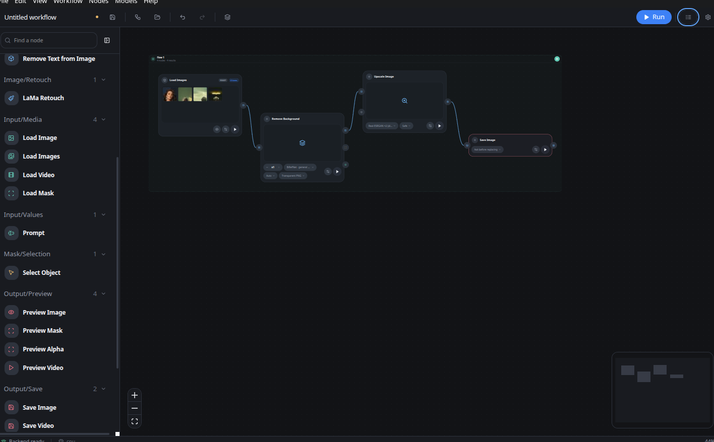
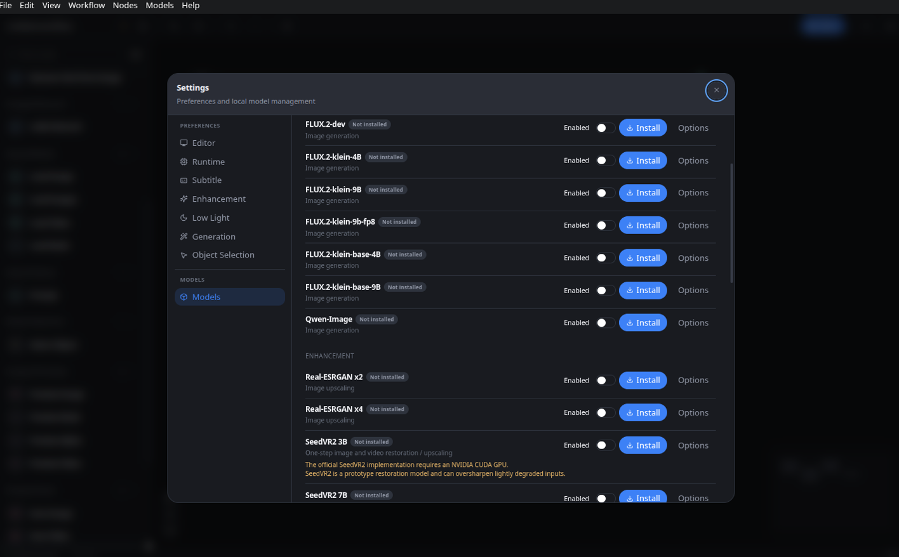
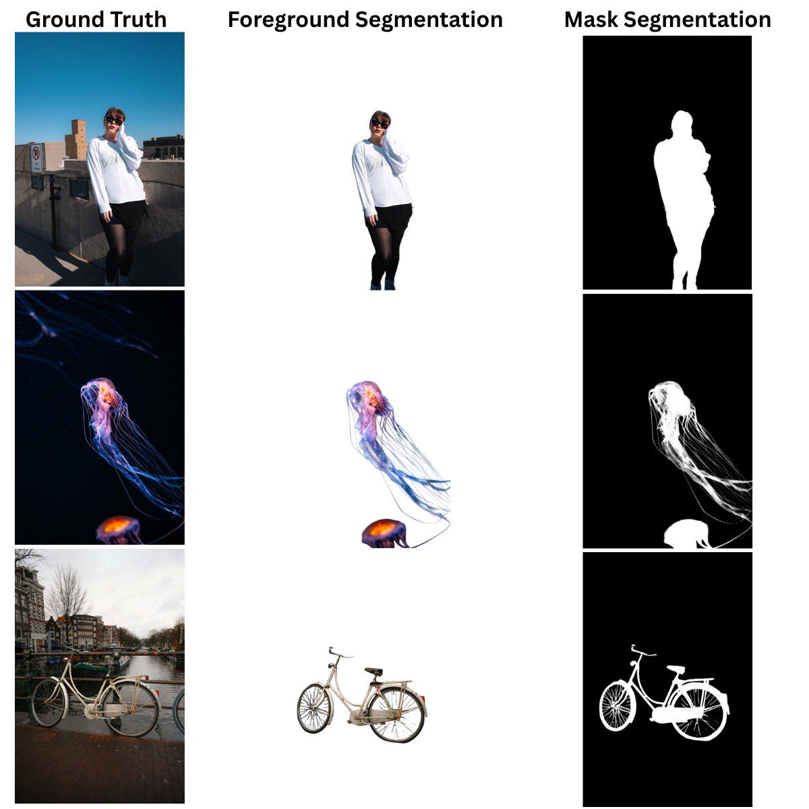
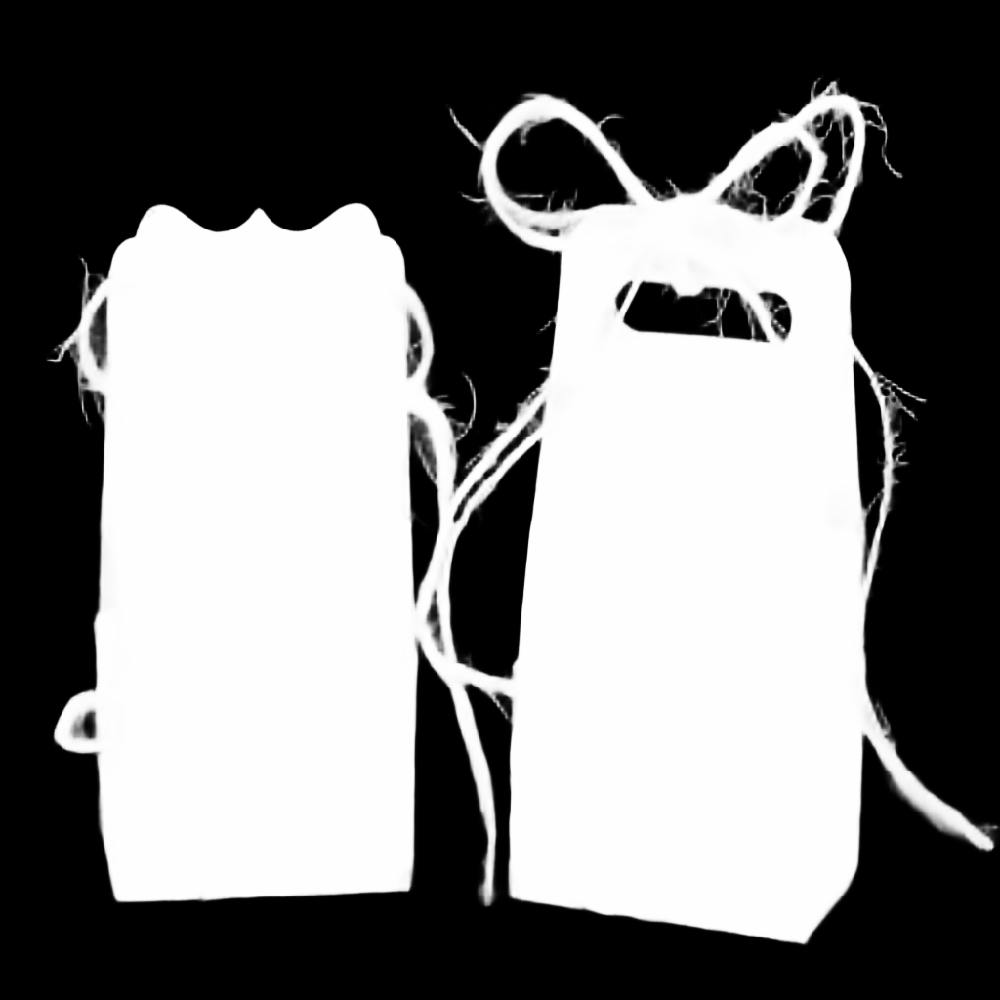
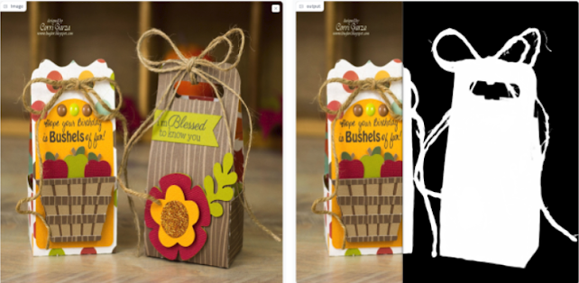
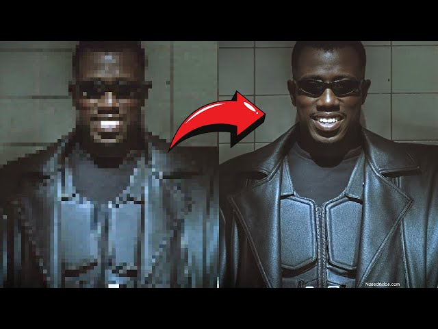
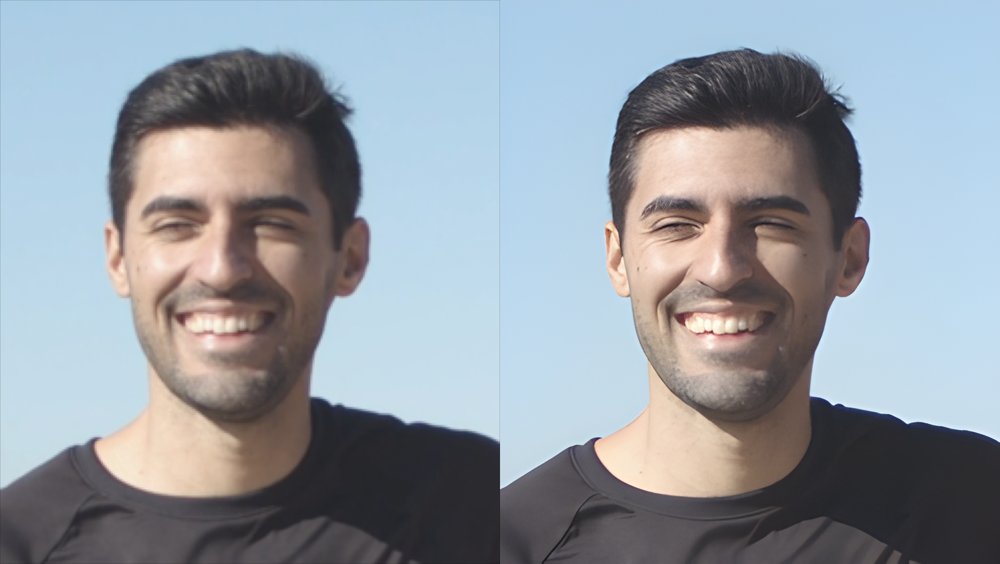
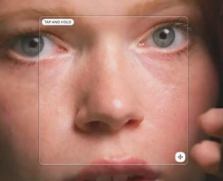
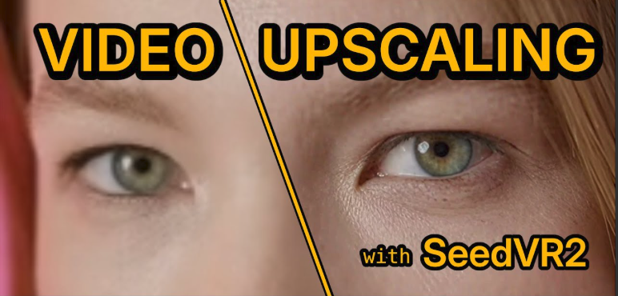

<p align="center">
  
</p>

<h1 align="center">Lluna</h1>

<p align="center">
  A local, node-based desktop app for image and video AI workflows.
</p>

<p align="center">
  
  
  
  
  
</p>

## What Lluna is

Lluna is a desktop app for building image and video AI pipelines by wiring nodes together on a canvas, similar to a visual node editor for compositing or shader graphs, but for AI models. It runs entirely on your own machine: the Electron app talks to a local Python backend over a loopback API, and your media, models, settings, and workflows never leave your computer unless you export them.

You can use it to:

- remove subtitles, watermarks, and other burned-in text from images and video;
- upscale and restore images or video, including one-step restoration with SeedVR2;
- fix low-light images;
- remove or replace backgrounds and composite foregrounds onto new backgrounds;
- select objects with clicks or a text description, then mask, retouch, or cut them out;
- describe an image in natural language with a vision-language model; and
- generate or edit images locally with diffusion models such as FLUX.2 and Qwen-Image.

## See it in action

<p align="center">
  
  
</p>

## How it works

Drag nodes onto the workspace, connect their ports left to right, and run the graph. Every node declares the model, capability, and hardware it needs, so incompatible connections and missing models are caught before you run anything.

```text
Load Image → Select Object → Remove Background → Preview Image → Save Image
Load Video → Remove Text from Video → Preview Video → Save Video
Prompt → Generate Image → Upscale Image → Save Image
Load Image → Describe Image → Generate Image → Preview Image → Save Image
```

Nodes are grouped by what they do:

| Group | Nodes |
| --- | --- |
| **Input** | Load Image, Load Images, Load Video, Load Mask, Prompt, Number, Integer, Boolean, LLaVA Caption, Describe Image |
| **Image** | Generate Image, Edit Image, Upscale Image, Remove Background, Fix Low Light, Composite Background, LaMa Retouch, Remove Text from Image |
| **Video** | Upscale Video, Remove Text from Video, Remove Background from Video |
| **Mask** | Select Object |
| **Output** | Preview Image, Preview Mask, Preview Alpha, Preview Video, Save Image, Save Video |

A few notes on specific nodes:

- **Load Images** accepts an ordered batch of up to 10 images, so downstream nodes can process a whole set at once.
- **Generate Image** and **Edit Image** stream a live preview while the diffusion model is sampling, and support BF16, FP16, FP32, and (for custom models with `bitsandbytes`) INT8/INT4 precision.
- **Select Object** creates a mask from canvas clicks or a text description, using SAM2 and Grounding DINO together.
- **Describe Image** runs a vision-language model you install yourself and feeds its output straight into a **Prompt** input elsewhere in the graph.

Workflows are saved as `*.lluna.json` files, so a graph you build can be reopened, shared, or version-controlled.

## Requirements

Before installing Lluna from source, make sure you have:

- 64-bit Python 3.12;
- Node.js 22 or newer;
- npm 10 or newer;
- an internet connection for the first installation and for model downloads; and
- enough disk space for the models you plan to install.

A GPU is optional. Lluna runs on CPU, but larger restoration and generation models need supported hardware and recent drivers.

| Platform | Available profiles | GPU acceleration |
| --- | --- | --- |
| Linux | CPU or CUDA | NVIDIA CUDA |
| Windows | CPU, CUDA, or DirectML | NVIDIA CUDA or DirectML-compatible hardware |
| macOS | CPU or MPS | Apple Silicon/Metal through PyTorch MPS, where supported |

## Installing (first time)

### 1. Clone the repository

```bash
git clone https://github.com/dexterR35/lluna.git
cd lluna
```

### 2. Run the installer

The installer creates the `llunaEnv` Python environment, picks the right dependency profile for your hardware, verifies the bundled assets, and installs the desktop (Node/npm) dependencies. No AI models are downloaded at this stage.

**Linux and macOS**

```bash
chmod +x install.sh   # only if the script is not already executable
./install.sh --mode auto
```

**Windows**

```bat
install.bat
```

`--mode auto` detects your hardware. You can also pick a profile explicitly, and add `--yes` to skip the interactive confirmation:

```bash
./install.sh --mode cpu
./install.sh --mode cuda --yes
./install.sh --mode directml --yes
./install.sh --mode mps --yes
```

```bat
install.bat --mode cuda --yes
```

Optionally, queue a small starter set of models (Real-ESRGAN x2, MIRNet LOL, and the fast SAM2 + Grounding DINO pair) to download during install:

```bash
./install.sh --mode auto --schedule-default-models
```

### 3. Start Lluna

```bash
npm run dev
```

If you only need to refresh desktop dependencies later, `npm install --allow-git=all` reruns what the installer already does.

## After opening the app

The app opens straight into the node editor, empty and ready to build a workflow. Everything else — installing a model, adding your own, connecting Hugging Face — happens from **Settings**, in the top toolbar.

### Install a built-in model

1. Open **Settings → Models**.
2. Find the model you want (filter by task: image generation, enhancement, low light, object selection, background removal, subtitle & text) and select **Install**.
3. Watch progress in **Activity → Downloads**.
4. Enable the model if it isn't enabled automatically.
5. Reopen the relevant node and pick the model from its dropdown.

Installed models, settings, and workflows live in Lluna's user data directory and persist across app updates — only your explicit choice to uninstall a model removes it.

### Add a custom model and connect Hugging Face

Open **Settings → Models → Add model**. You can install from:

- **Hugging Face** — paste a repository URL (`https://huggingface.co/owner/model`); Lluna analyzes the repo's model card and config before anything downloads;
- a **local folder** already containing model weights; or
- a single **weight file** (`.safetensors`, `.pth`, `.pt`, `.ckpt`, or `.bin`).

For gated Hugging Face repositories, connect your account under **Settings → Models → Hugging Face** with an access token, then accept the model's license on Hugging Face before installing.

Before a custom model can be enabled, Lluna resolves its task, inputs/outputs, and hardware requirements from (in order) a reviewed catalog entry, the repository's own model card and config, or safe local inspection of its declarative config files — it never imports model code or loads weights just to identify them. A model stays **Needs configuration** until that review passes. SafeTensors is preferred; formats that can carry Python pickle data, and any repository's own `requirements.txt`, are never trusted or installed automatically. See the [model platform guide](backend/models/reference/PLATFORM.md) for the full storage layout and safety model, and the [model reference](backend/models/reference/README.md) for the manifest format.

Once installed, a custom model appears in the **Model** dropdown of every node whose task it matches — including **Describe Image**, which is designed around models you bring yourself.

## Models

### Bundled (no download needed)

| Model | Used for |
| --- | --- |
| **LaMa** | Masked retouching (**LaMa Retouch**); works on CPU |
| **PaddleOCR Server** / **PaddleOCR Mobile** | Text detection for **Remove Text from Image/Video** |
| **STTN Auto** / **STTN Detection** | Text-aware video inpainting |
| **ProPainter** | Video inpainting |

### Optional, by feature

| Feature | Model(s) | Hugging Face repo | Notes |
| --- | --- | --- | --- |
| Upscale an image | **Real-ESRGAN x2 / x4** | — (GitHub release) | Good default; x2 is a good first choice |
| High-quality image restoration | **SUPIR v0** | pinned mirror + SDXL 1.0 | CUDA only; ~75 GB disk, 32 GB RAM, 12 GB VRAM minimum; non-commercial license |
| One-step image or video restoration | **SeedVR2 3B / 7B** | `ByteDance-Seed/SeedVR2-3B` / `-7B` | CUDA only; ~14.6 GB/66.9 GB disk, 24 GB/48 GB VRAM minimum |
| Fix low-light images | **MIRNet LOL** | `swz30/MIRNet` | CPU, CUDA, DirectML, and MPS |
| Select an object | **SAM2** + **Grounding DINO** | `facebook/sam2-hiera-*` + `IDEA-Research/grounding-dino-*` | Start with the fast pair; large/base pair trades speed for quality |
| Remove a background (image or video) | **BiRefNet** family | `zhengpeng7/BiRefNet*` | Standard, Dynamic, HR, HR Matting, Lite 2K, and Matting variants |
| Generate or edit an image | **FLUX.2** or **Qwen-Image** | `black-forest-labs/FLUX.2-*` / `Qwen/Qwen-Image` | Large; generally needs CUDA |
| Describe an image | any vision-language model you add | user-supplied | Add via **Settings → Models → Add model** |
| Composite a foreground and background | none | — | Uses images already loaded in the graph |

If a node's model dropdown is empty, install and enable the model listed above for that feature, then reopen the node.

### Choosing a generation model

| Model | Good choice when | Approximate requirement |
| --- | --- | --- |
| **FLUX.2 Klein Base 4B** | You want the recommended starting model | ~16 GB RAM, 12 GB VRAM |
| **FLUX.2 Klein 4B / 9B** | You want general image generation | Memory scales with model size |
| **FLUX.2 Klein 9B FP8** | You want a lighter 9B option | ~32 GB RAM, 10 GB VRAM |
| **FLUX.2 Dev** | You have more memory and want a higher-capacity model | ~64 GB RAM; gated, non-commercial license |
| **Qwen-Image** | You want an alternative general-purpose model | ~64 GB RAM, 12 GB VRAM |

Some models require accepting an upstream or gated-model license on Hugging Face before they can be downloaded. Model licenses are separate from Lluna's own license — check each model card before use or redistribution.

### Examples

<p align="center">
  
  
</p>

<p align="center">
  
</p>

<p align="center">
  
  
</p>

<p align="center">
  
  
</p>

<p align="center">
  
  
</p>

## Example workflows

**Remove text from an image**
```text
Load Image → Remove Text from Image → Preview Image → Save Image
```

**Remove subtitles from a video**
```text
Load Video → Remove Text from Video → Preview Video → Save Video
```

**Create a transparent cut-out**
```text
Load Image → Remove Background → Preview Alpha → Save Image
```

**Generate and upscale an image**
```text
Prompt → Generate Image → Upscale Image → Preview Image → Save Image
```

**Select and retouch an object**
```text
Load Image → Select Object → LaMa Retouch → Preview Image → Save Image
```

**Describe an image, then generate a new one from it**
```text
Load Image → Describe Image → Generate Image → Preview Image → Save Image
```

## Development

```bash
npm run build           # Build the production UI
npm run lint            # Lint the frontend
npm run check           # Run frontend checks and static guards
npm run test:frontend   # Run frontend tests
npm run test:backend    # Run Python backend tests
npm test                # Run frontend and backend tests
```

See [packaging/build.py](packaging/build.py) for packaged builds and frozen sidecars. The backend structure is documented in [backend/ARCHITECTURE.md](backend/ARCHITECTURE.md).

## Update

```bash
git pull
./install.sh --mode auto        # install.bat --mode auto on Windows
npm install --allow-git=all
npm run dev
```

Updating the source does not remove your installed models, settings, or saved workflows.

## Privacy

Lluna runs its API on the local loopback interface with a token generated for each launch, and the Electron renderer is sandboxed. Your media stays on your computer unless you choose to export or copy it elsewhere. When you install a model, the download request goes directly to the upstream provider (Hugging Face, GitHub, etc.) you selected.

## License

Lluna's source code is distributed under the repository [LICENSE](LICENSE).

Model weights and third-party components use their own licenses. Read [THIRD_PARTY_NOTICES.md](THIRD_PARTY_NOTICES.md) and the upstream license for each model before using or redistributing it.
