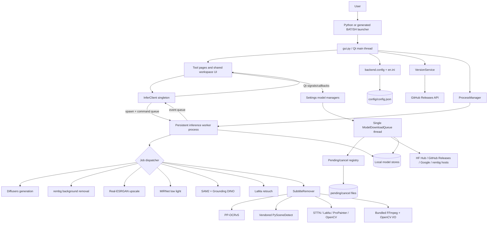

# Stage 0 — Repository Discovery and Technical Mapping

## Audit rules and snapshot

This report audits the source repository identified by the user as
`https://github.com/dexterR35/midgard`.

- Audit date: 2026-07-27.
- Current branch: `main`.
- Inspected commit: `c7aa179` (`aupdate models`, 2026-07-27).
- Configured Git origin: `https://github.com/dexterR35/midgard.git`.
- Worktree at audit start: no tracked modifications; pre-existing untracked files
  `docs/prepare.md` and `implementation-after-stages.md` were not altered.
- Repository-local instructions: neither `AGENTS.md` nor `CONTRIBUTING.md` exists.
- Audit method: static, read-only inspection. No application launch, inference,
  installer execution, dependency installation, model download, or model mutation
  was performed.
- Sole audit output: this report.
- Scope boundary: this report describes existing packaging-related files because
  Stage 0 explicitly requires their discovery. It does not endorse native/binary
  distribution. All recommendations retain Python/BAT/SH source launches.

Classification used below:

- **Verified fact** — directly established from the current branch or working tree.
- **Probable finding** — strongly indicated by static inspection but needs runtime
  confirmation.
- **Recommendation** — high-level audit or architecture direction only.
- **Unknown** — requires controlled runtime, platform, network, or model validation.

## 1. Application overview

### Verified facts

Midgard 1.4.0 is a local Python/PySide6 desktop AI studio. Its declared functions
are text/subtitle removal, background removal, image upscaling, low-light
restoration, object selection, and text-to-image generation
(`README.md:5-15`, `README.md:102-114`; version constant at
`backend/config.py:22-29`).

The application has three principal runtime layers:

1. A PySide6/qfluentwidgets GUI process rooted at `gui.py`.
2. One persistent, spawned Python inference process managed by
   `backend.tools.infer_client.InferClient` and entered through
   `backend.tools.infer_worker.infer_worker_main`
   (`backend/tools/infer_client.py:93-102`, `backend/tools/infer_client.py:160-201`,
   `backend/tools/infer_worker.py:94-126`).
3. Local model, image/video, download, configuration, and FFmpeg services under
   `backend/`, with UI-specific orchestration under `ui/`.

Inference is local. Network access is nevertheless used for dependency/model
downloads and update checks; therefore the README's “No cloud API” statement is
accurate for inference but should not be read as “no network activity”
(`README.md:7-10`, `backend/tools/version_service.py:21-50`,
`backend/tools/generate_models.py:232-300`).

The root project license is Apache License 2.0 (`LICENSE:1-5`). Vendored components
and model weights have their own provenance/licensing concerns; for example, the
vendored PySceneDetect package identifies itself as BSD-3-Clause
(`backend/scenedetect/__init__.py:1-16`).

## 2. Project purpose

### Verified facts

The product is intended to keep media processing on the user's machine and to
preserve source resolution where the selected operation allows it
(`README.md:7-10`). Its functional surfaces are:

- Generate Image: FLUX.2 Klein, FLUX.2 Dev, or Qwen-Image through Diffusers, CUDA-only
  (`README.md:53-84`, `backend/tools/generate_models.py:27-71`,
  `backend/tools/generate_models.py:321-349`).
- Remove Text: OCR-assisted subtitle/text detection followed by STTN, LaMa,
  ProPainter, or OpenCV inpainting (`backend/tools/constant.py:3-21`,
  `backend/main.py:348-405`).
- Remove BG: rembg/ONNX cutout with optional protect masks and subsequent LaMa
  retouch (`backend/tools/bg_remove.py:1-19`,
  `backend/tools/infer_worker.py:447-499`,
  `backend/tools/infer_worker.py:525-575`).
- Image Upscale: Real-ESRGAN x2/x4 with optional denoise
  (`backend/tools/enhance_models.py:25-46`,
  `backend/tools/infer_worker.py:223-280`).
- Fix Low Light: MIRNet restoration (`backend/tools/low_light_models.py:25-35`,
  `backend/tools/infer_worker.py:283-349`).
- Select Object: SAM2 point segmentation and Grounding DINO text grounding
  (`backend/tools/select_object_models.py:40-90`,
  `backend/tools/infer_worker.py:578-649`).

## 3. Current repository tree

### Verified facts

The current commit contains 240 tracked files, including 187 Python files. All 187
Python files parsed successfully with Python's AST parser. Three forward-looking
invalid-escape `SyntaxWarning`s were observed in the vendored scene-detection CLI,
but no syntax errors.

The functional tree is:

```text
.
├── .github/
│   └── workflows/
│       ├── build-docker.yml
│       ├── build-windows-cpu.yml
│       ├── build-windows-cuda-11.8.yml
│       ├── build-windows-cuda-12.6.yml
│       ├── build-windows-cuda-12.8.yml
│       └── build-windows-directml.yml
├── backend/
│   ├── config.py
│   ├── main.py
│   ├── ffmpeg/
│   │   ├── linux_x64/
│   │   ├── macos/
│   │   └── win_x64/
│   ├── inpaint/
│   │   ├── sttn/
│   │   ├── utils/
│   │   └── video/              # ProPainter/RAFT model and training support
│   ├── interface/
│   │   └── en.ini
│   ├── models/
│   │   ├── V5/                 # tracked PP-OCRv5 server/mobile
│   │   ├── big-lama/           # tracked split parts; merged file ignored
│   │   ├── propainter/          # tracked parts and auxiliary weights
│   │   ├── sttn-auto/
│   │   └── sttn-det/
│   ├── scenedetect/            # vendored PySceneDetect 0.6.2
│   └── tools/
│       ├── concurrent/
│       ├── train/
│       ├── inference IPC/runtime modules
│       ├── model catalogs/download lifecycle
│       └── media/hardware/config helpers
├── docker/
│   └── Dockerfile
├── docs/
│   └── midgard.png
├── test/
│   ├── low_light.png
│   ├── rm-bg.png
│   └── scale-image.png
├── tests/
│   ├── __init__.py
│   └── test_enhance_denoise.py
├── ui/
│   ├── primary tool/settings pages
│   ├── component/
│   │   ├── cards/
│   │   ├── controls/
│   │   ├── preview/
│   │   ├── utils/
│   │   └── workspace/
│   └── icon/
├── .gitignore
├── LICENSE
├── README.md
├── gui.py
├── install.py
└── requirements.txt
```

Tracked distribution metadata is intentionally minimal: there is no
`pyproject.toml`, `setup.py`, `setup.cfg`, constraints file, or development
requirements file. `requirements.txt` is the only tracked requirements file.

Tracked launcher state differs from installed working-tree state:

- `install.py` is tracked.
- `install.bat` and `install.sh` do not exist.
- `run_gui.bat` and `run_gui.sh` are ignored generated artifacts
  (`.gitignore:1-8`).
- This audited working tree currently has a generated `run_gui.sh`, but no
  `run_gui.bat`. Neither is part of the commit.

Downloaded local model directories (`backend/models/realesrgan`,
`backend/models/mirnet`, `backend/models/select_object`, and
`backend/models/generate`) are ignored rather than bundled
(`.gitignore:25-39`). Their presence in this working tree was noted without
opening weights or changing them.

## 4. Entry-point map

### Verified facts

| Entry point | Status and route |
|---|---|
| `python gui.py` | Primary GUI entry. Forces multiprocessing `spawn`, creates `QApplication`, constructs `SubtitleExtractorGUI`, shows it, and enters the event loop (`gui.py:337-353`). |
| `run_gui.sh` | Generated on non-Windows systems by `install.write_launchers`; changes to the project directory and executes the virtual-environment Python against `gui.py` (`install.py:896-917`). Present locally but ignored. |
| `run_gui.bat` | Generated on Windows by the same function and calls the virtual-environment Python against `gui.py` (`install.py:896-906`). Absent in this Linux working tree and absent from Git. |
| `python install.py` | Primary installer entry. Parses mode flags and runs detection, virtual-environment setup, dependencies, model verification/seeding, runtime metadata, and launcher generation (`install.py:920-1025`). |
| `install.bat` | Absent; no implementation or forwarding wrapper exists. |
| `install.sh` | Absent; no implementation or forwarding wrapper exists. |
| `python backend/main.py` | CLI for `remove-text` and `remove-bg`. Parses `--task`, required input, output, model/mask options, then dispatches (`backend/tools/args_handler.py:15-62`, `backend/main.py:498-550`). |
| `python -m backend.scenedetect` | Incidental vendored PySceneDetect CLI entry, not documented as a Midgard product entry (`backend/scenedetect/__main__.py:18-22`). |
| `infer_worker_main` | Spawn target only; receives command/event multiprocessing queues and executes one job at a time (`backend/tools/infer_client.py:170-184`, `backend/tools/infer_worker.py:94-159`). |
| Model download worker | Lazily created daemon thread in the GUI process by `ModelDownloadQueue.enqueue` (`backend/tools/model_download_queue.py:63-83`, `backend/tools/model_download_queue.py:128-153`). |
| Update check | Delayed Qt timer from the main window, then a Qt thread-pool task invoking `VersionService.has_new_version` (`gui.py:198-206`, `ui/advanced_setting_interface.py:445-464`). |

### Probable finding

`docker/Dockerfile` defaults to `python /midgard/backend/main.py` without the
required `--input` argument (`docker/Dockerfile:107`,
`backend/tools/args_handler.py:26-32`). A container started without overriding
its command will probably exit with argparse usage/error rather than provide a
useful application service.

## 5. Module-responsibility table

### Verified facts

| Area | Primary files/classes/functions | Responsibility |
|---|---|---|
| Desktop composition | `gui.py:43-143` `SubtitleExtractorGUI`; `ui/shell.py:26-38` | Creates pages, navigation, shared busy gating, update scheduling, startup services, and window shutdown. |
| Generate UI | `ui/dashboard_interface.py:288`; job submission at `ui/dashboard_interface.py:576-631` | Prompt/options, CUDA/model gate, output allocation, worker callbacks, preview. |
| Remove Text UI | `ui/home_interface.py:24`; queue at `ui/home_interface.py:515-632`; worker submission at `ui/home_interface.py:662-766` | Media task queue, selection/AB options, subtitle job orchestration, comparison and preview. |
| Remove BG UI | `ui/bg_remove_interface.py:85`; submission at `ui/bg_remove_interface.py:944-1059` | Image queue, automatic/protect flow, temporary preview, save/reset, background-removal IPC. |
| Protect/retouch/select UI | `ui/bg_protect_dialog.py:37`; `ui/bg_retouch_dialog.py:51`; `ui/component/select_object_controller.py:22-152` | Keep-mask editing, LaMa fill, click/text object selection. |
| Upscale UI | `ui/upscale_interface.py:56`; submission at `ui/upscale_interface.py:662-664` | Batch image upscale queue, options, previews, save/reset. |
| Low-light UI | `ui/low_light_interface.py:54`; submission at `ui/low_light_interface.py:612-622` | Batch MIRNet queue, previews, save/reset. |
| Settings/model managers | `ui/advanced_setting_interface.py:40`; model managers at `ui/component/cards/*_model_manager.py` | Persistent settings, model install/uninstall/on-off, token UI, update links, download banner. |
| Shared workspace/preview | `ui/component/workspace/workspace_page.py:25-209`; `ui/component/workspace/task_list_component.py:33-70`; `ui/component/preview/*` | Reusable task rail, action bar, log, media preview, image zoom, video selections, retouch canvas. |
| GUI-side inference controller | `backend/tools/infer_client.py:93-138` | Singleton worker lifecycle, queues, callbacks, same-tool FIFO, watchdog, cancel/recycle/shutdown. |
| IPC contract | `backend/tools/infer_protocol.py:9-100` | Job, command, event enums and tuple wire constructors. |
| Worker dispatcher | `backend/tools/infer_worker.py:94-220` | Single-flight command loop and dispatch across seven job types. |
| Subtitle engine | `backend/main.py:39-94` `SubtitleRemover`; `backend/main.py:348-495` | Video/image decode, OCR/masks, selected inpaint algorithm, encode, audio merge, cleanup. |
| OCR/scene detection | `backend/tools/subtitle_detect.py:16-148`; `backend/scenedetect/__init__.py:104-158` | PP-OCRv5 box detection, temporal interpolation, scene-boundary splitting. |
| Inpainting backends | `backend/inpaint/lama_inpaint.py:11-134`; `backend/inpaint/sttn_auto_inpaint.py:28-167`; `backend/inpaint/sttn_det_inpaint.py:23`; `backend/inpaint/propainter_inpaint.py:139`; `backend/inpaint/opencv_inpaint.py:3-15` | Model-specific frame/video inpainting. |
| Image inference | `backend/tools/bg_remove.py:19`; `backend/tools/image_enhance.py:119-568`; `backend/tools/image_low_light.py:130-383`; `backend/tools/image_generate.py:147-390`; `backend/tools/grounded_sam2.py` | rembg, Real-ESRGAN, MIRNet, Diffusers, and SAM2/DINO execution/caches. |
| Hardware/VRAM | `backend/tools/hardware_accelerator.py:8-215`; `backend/tools/vram_budget.py:25-201`; `backend/tools/soft_defaults.py` | CUDA/MPS/DirectML/ORT provider detection, device choice, preflight budgeting, first-run tuning. |
| Model catalogs | `backend/tools/bg_remove_models.py:23-50`; `backend/tools/enhance_models.py:25-50`; `backend/tools/low_light_models.py:25-41`; `backend/tools/select_object_models.py:40-90`; `backend/tools/generate_models.py:27-79` | Model identifiers, source locations, local paths, installed/enabled state, install/uninstall. |
| Download lifecycle | `backend/tools/model_download_queue.py:23-153`; `backend/tools/model_download_registry.py:46-236`; `backend/tools/first_run_downloads.py:28-102`; `backend/tools/model_download_lifecycle.py:25-91` | FIFO serialization, persistent pending registry, cancellation/partial cleanup, first-open restart. |
| Configuration/i18n | `backend/config.py:38-264`; `backend/interface/en.ini` | QConfig schema and JSON persistence, hardcoded UI constants, English strings. |
| Media I/O | `backend/tools/ffmpeg_cli.py:8-35`; `backend/tools/video_io.py:10-102`; `backend/tools/merge_video.py:1-111` | Bundled FFmpeg resolution, frame prefetch, x264 pipe, audio merge, comparison video. |
| Process/task utilities | `backend/tools/process_manager.py:13-159`; `backend/tools/concurrent/task_manager.py:16-105` | Child-process registry/termination and Qt thread-pool tasks. |
| Diagnostics | `backend/tools/diag.py:69-241`; `backend/tools/diag_health.py:17-348`; `ui/diag_hooks.py:20-236` | CLI diagnostic categories, startup/job health summaries, Qt hooks. |
| Installer | `install.py:92-1025` | Python/GPU detection, venv, dependency selection, core-weight merge, first-run model seed, runtime/launchers. |
| Container/automation | `docker/Dockerfile`; `.github/workflows/*.yml`; `backend/tools/makedist.py:10-64` | Container dependency builds and legacy Windows distribution automation. |
| Tests | `tests/test_enhance_denoise.py:38-95` | Narrow unit coverage for fringe cleanup, denoise, validation, cancellation, and preprocess passthrough. |
| Training/vendored research code | `backend/tools/train/`; `backend/inpaint/video/core/`; `backend/inpaint/video/model/`; `backend/inpaint/video/raft/` | STTN/ProPainter training, architectures, metrics, loaders, RAFT and flow modules. Not part of normal GUI orchestration. |

## 6. GUI startup sequence

### Verified facts

1. Python imports diagnostics and removes diagnostic CLI flags
   (`gui.py:4-10`).
2. A Paddle CDN-hoster check patch is installed before Qt/Paddle-dependent
   application imports (`gui.py:12-20`; patch purpose at
   `backend/tools/paddle_cdn_patch.py:1-8`).
3. `backend.config` constructs `Config`, loads relative
   `config/config.json`, forces the dark theme in memory, and loads
   `backend/interface/en.ini` (`backend/config.py:249-264`).
4. The direct entry forces multiprocessing `spawn`, constructs `QApplication`,
   and installs diagnostic hooks (`gui.py:337-348`).
5. `SubtitleExtractorGUI.__init__` configures window chrome, creates the six
   page objects, registers routes, wires page/model signals, and applies the
   shell (`gui.py:43-64`, `gui.py:101-196`).
6. A stored Hugging Face token, if present, is copied to process environment
   variables (`gui.py:66-71`, `backend/tools/hf_auth.py:21-44`).
7. The startup update timer is scheduled when enabled (`gui.py:73-74`,
   `gui.py:198-206`).
8. First-run soft defaults are attempted (`gui.py:75-80`).
9. `InferClient.ensure_started` spawns the daemon inference process and starts
   event-reader and watchdog daemon threads (`gui.py:81-86`,
   `backend/tools/infer_client.py:160-201`).
10. Diagnostic health reporting runs, then pending/default model downloads are
    prepared and scheduled (`gui.py:87-98`,
    `backend/tools/model_download_lifecycle.py:40-53`).
11. The window is shown, centered, and the Qt event loop starts
    (`gui.py:347-353`).

### Probable findings

- Because `CONFIG_FILE` is relative rather than anchored to the repository
  (`backend/config.py:249-251`), direct imports or nonstandard launches from a
  different current directory may read/write a different `config/config.json`.
  Generated launchers avoid this by changing into the repository first
  (`install.py:896-915`).
- Broad `except Exception: pass` blocks around several startup services can
  leave partially unavailable features without a user-visible failure
  (`gui.py:66-98`).

## 7. Installer sequence

### Verified facts

`install.main` performs:

1. CLI parsing for auto/CPU/CUDA, CUDA wheel override, noninteractive mode, and
   optional rembg-default skipping (`install.py:920-950`).
2. NVIDIA detection through `nvidia-smi`, including name, driver CUDA level,
   compute capability, and VRAM (`install.py:140-219`).
3. CUDA wheel mapping by compute capability/GPU name and driver ceiling
   (`install.py:240-395`).
4. GUI or terminal acceleration selection, with forced CUDA falling back to CPU
   when detection fails (`install.py:398-523`).
5. Python selection preferring 3.12, then 3.13 and 3.11
   (`install.py:92-137`).
6. Creation/reuse of `midgardEnv`; if ensurepip fails, temporary download and
   execution of `get-pip.py` (`install.py:526-555`).
7. Mode-specific Paddle, Torch, torchvision, ONNX Runtime, and root
   requirements installation (`install.py:558-641`).
8. Import verification of core runtime and model APIs
   (`install.py:644-676`).
9. Presence checking of core model artifacts and merging of split LaMa and
   ProPainter files (`install.py:679-729`).
10. Clearing an earlier pending-download lifecycle, then scheduling first-open
    defaults rather than downloading them inside the installer
    (`install.py:986-996`, `backend/tools/first_run_downloads.py:28-66`).
11. Writing ignored `midgard_runtime.json` and the platform launcher
    (`install.py:882-917`, `install.py:998-1005`).

The default scheduled set is four rembg models, Real-ESRGAN x2, MIRNet LOL, and
the fast SAM2/DINO pair (`backend/tools/first_run_downloads.py:19-25`,
`backend/tools/first_run_downloads.py:42-64`).

### Probable findings

- The README badge says Python 3.12+, while the installer deliberately supports
  3.11 through 3.13 (`README.md:12-15`, `install.py:92-137`). This is a
  documentation/support-contract mismatch.
- Reusing an existing `midgardEnv` without checking which interpreter created it
  can preserve an incompatible environment (`install.py:532-537`).

## 8. Inference job sequence

### Verified facts

The GUI and worker share the tuple-based protocol defined in
`backend/tools/infer_protocol.py:9-100`.

General sequence:

1. A tool validates UI state and builds a serializable payload. Examples:
   Generate (`ui/dashboard_interface.py:576-604`), Remove BG
   (`ui/bg_remove_interface.py:1027-1046`), and Remove Text
   (`ui/home_interface.py:729-745`).
2. `InferClient.start_job` ensures the worker exists and classifies the request:
   one active job, same-type FIFO, cross-type rejection, or a coalesced
   replacement (`backend/tools/infer_client.py:407-503`).
3. `_start_unlocked` assigns a monotonically increasing run ID and puts
   `START_JOB` on the multiprocessing command queue
   (`backend/tools/infer_client.py:505-532`).
4. The worker synchronously releases every heavy modality except the requested
   one, then dispatches one of seven job types
   (`backend/tools/infer_worker.py:32-91`,
   `backend/tools/infer_worker.py:126-157`).
5. Job handlers apply the payload's hardware/config snapshot, preflight resource
   needs, ensure weights, run inference, write a file result, and emit progress,
   log, preview, result, or error events. Subtitle settings are explicitly
   snapshotted because the long-lived worker's config would otherwise become
   stale (`backend/tools/job_config.py:1-7`,
   `backend/tools/job_config.py:22-85`).
6. The GUI-side event-reader thread filters stale run IDs, invokes callbacks,
   completes the active record, and flushes a coalesced or same-type queued job
   (`backend/tools/infer_client.py:203-301`,
   `backend/tools/infer_client.py:534-567`).
7. The watchdog pings after 15 seconds of silence and kills/respawns after the
   configured timeout (`backend/tools/infer_client.py:303-351`).

Per-job routes:

- Enhance: ensure Real-ESRGAN, optional denoise, tiled RGBA enhancement, PNG
  output (`backend/tools/infer_worker.py:223-280`).
- Low light: MIRNet preflight/load/inference, PNG output
  (`backend/tools/infer_worker.py:283-349`).
- Generate: hard CUDA gate, model ensure/load, Diffusers call, heartbeat thread,
  PNG output (`backend/tools/infer_worker.py:352-444`).
- Remove BG: rembg session, optional protect mask merge, PNG output
  (`backend/tools/infer_worker.py:447-499`).
- LaMa retouch: temporary RGBA/mask inputs, cutout-aware context, PNG output
  (`backend/tools/infer_worker.py:502-575`).
- Select subject: resolved fast/complex SAM2+DINO pair, click or text prompt,
  mask output (`backend/tools/infer_worker.py:578-649`).
- Subtitle: config snapshot, video resolution/VRAM preflight,
  `SubtitleRemover.run`, preview events, and model release
  (`backend/tools/infer_worker.py:652-742`).

Subtitle engine sequence:

1. `SubtitleRemover` opens media, determines image/video geometry, creates a
   temporary video writer, and chooses default output (`backend/main.py:39-92`).
2. It defaults an empty selection to full-frame (`backend/main.py:348-355`).
3. Images use OCR + LaMa; videos select ProPainter, STTN Auto, STTN Detection,
   LaMa, or OpenCV (`backend/main.py:366-399`).
4. Video frames are prefetched on a thread and encoded through bundled FFmpeg
   with OpenCV fallback (`backend/main.py:69-73`,
   `backend/tools/video_io.py:10-49`, `backend/tools/video_io.py:52-102`).
5. Original audio is copied through FFmpeg; on failure, the silent temporary
   video is copied to the requested output (`backend/main.py:401-414`,
   `backend/main.py:431-473`).

### Verified architecture defect

The worker handles a job inline inside the same loop that consumes `CANCEL`,
`PING`, `RELEASE`, and `SHUTDOWN` (`backend/tools/infer_worker.py:159-216`).
Enhance and low-light are designated soft-cancel types, so their parent merely
queues `CANCEL` (`backend/tools/infer_client.py:602-639`). The worker cannot
consume that message and set its cancellation event until the inline job has
already returned. Static control flow therefore shows that normal soft
cancellation cannot interrupt an active enhance or low-light job. Hard-cancel
types work differently because the parent terminates/restarts the process
(`backend/tools/infer_client.py:608-632`).

## 9. Model download sequence

### Verified facts

1. `install.py` seeds missing defaults into
   `config/pending_model_downloads.json`
   (`backend/tools/first_run_downloads.py:28-66`,
   `backend/tools/model_download_registry.py:31-36`).
2. GUI startup clears the cancel flag, deletes incomplete artifacts for pending
   entries, re-seeds missing defaults, and schedules dispatch after 800 ms
   (`backend/tools/model_download_lifecycle.py:33-53`).
3. Settings managers call the shared `ModelDownloadQueue`, which deduplicates
   `(kind,key)` and executes FIFO on one daemon thread
   (`backend/tools/model_download_queue.py:63-83`,
   `backend/tools/model_download_queue.py:128-153`).
4. The persistent registry marks begin/complete/fail and updates the JSON list
   (`backend/tools/model_download_registry.py:93-139`,
   `backend/tools/model_download_registry.py:172-200`).
5. Download mechanism varies:
   - rembg's session class downloads ONNX (`backend/tools/bg_remove_models.py:182-235`);
   - Real-ESRGAN/MIRNet use `urllib.request.urlretrieve` and `.part` files
     (`backend/tools/enhance_models.py:187-230`,
     `backend/tools/low_light_models.py:164-219`);
   - Generate and Select Object use Hugging Face `snapshot_download`
     (`backend/tools/generate_models.py:232-300`,
     `backend/tools/select_object_models.py:303-353`).
6. On GUI shutdown, cancellation is signaled, pending items are retained, and
   partial artifacts are discarded. Reopen starts them over, not resumes them
   (`backend/tools/model_download_registry.py:141-170`,
   `backend/tools/model_download_lifecycle.py:25-37`).

### Verified supply-chain limitation

The app validates existence, minimum size, marker/config presence, or completion
state, but does not maintain expected cryptographic hashes for downloaded model
artifacts. Even bundled split manifests have empty encoding/header fields and no
hashes (`backend/models/big-lama/fs_manifest.csv:1-6`,
`backend/models/propainter/fs_manifest.csv:1-5`). This is an integrity and
reproducibility risk, not evidence that any current file is malicious.

## 10. Shutdown sequence

### Verified facts

Normal main-window close:

1. `SubtitleExtractorGUI.closeEvent` requests model-download cancellation and
   partial cleanup (`gui.py:234-242`).
2. It calls `InferClient.shutdown` (`gui.py:243-248`).
3. `InferClient.shutdown` clears pending/wait/active state, queues `SHUTDOWN`,
   and terminates the worker (`backend/tools/infer_client.py:680-695`).
4. The main window asks `ProcessManager` to terminate any remaining registered
   children (`gui.py:249-252`).
5. `ProcessManager.terminate_all` uses a thread pool; termination escalates from
   process terminate/join/wait to kill and OS PID-tree cleanup
   (`backend/tools/process_manager.py:82-159`).

Additional safety nets are registered with `atexit` for both `InferClient` and
`ProcessManager` (`backend/tools/infer_client.py:132-138`,
`backend/tools/process_manager.py:27-35`).

Tool-level reset/close paths also cancel active jobs and may recycle the shared
worker to return RAM (`backend/tools/infer_client.py:386-405`,
`ui/home_interface.py:969-996`).

### Unknown

Static inspection cannot prove that every FFmpeg descendant, model-download
network call, and worker process exits promptly on Windows, macOS, and Linux.

## 11. Current architecture diagram — Mermaid



## 12. Current architecture diagram — plain text

```text
Python / generated BAT or SH
└── gui.py (Qt main process)
    ├── Config + English translation
    ├── Dashboard / Upscale / Remove BG / Remove Text / Low Light / Settings
    │   ├── per-tool GUI queue threads where batching is used
    │   └── InferClient
    │       ├── event-reader thread
    │       ├── watchdog thread
    │       └── spawned persistent inference process
    │           └── one job at a time
    │               ├── Diffusers
    │               ├── rembg
    │               ├── Real-ESRGAN
    │               ├── MIRNet
    │               ├── SAM2 + Grounding DINO
    │               ├── LaMa retouch
    │               └── SubtitleRemover
    │                   ├── PP-OCRv5
    │                   ├── PySceneDetect
    │                   ├── STTN / LaMa / ProPainter / OpenCV
    │                   └── frame-prefetch thread + FFmpeg subprocess
    ├── Settings model managers
    │   └── single FIFO download thread
    │       ├── persistent pending/cancel registry
    │       └── model hosts -> local model stores
    ├── Qt thread pool -> update check
    └── ProcessManager -> worker/child termination
```

## 13. Thread and process model

### Verified facts

| Context | Execution units |
|---|---|
| GUI process | Qt main/event thread. |
| GUI process | `infer-evt-reader` daemon thread and `infer-watchdog` daemon thread (`backend/tools/infer_client.py:190-201`). |
| GUI process | At most one model-download daemon thread for the global FIFO (`backend/tools/model_download_queue.py:79-81`). |
| GUI process | Per-tool daemon batching threads for Remove Text, Remove BG, Upscale, and Low Light (`ui/home_interface.py:630-632`, `ui/bg_remove_interface.py:940-942`, `ui/upscale_interface.py:585`, `ui/low_light_interface.py:545-546`). |
| GUI process | Optional compare-merge daemon thread (`ui/home_interface.py:503`). |
| GUI process | Qt global thread-pool task for update checking (`ui/advanced_setting_interface.py:445-448`). |
| GUI process | Qt timers for update delay, previews, resource display, and retouch coalescing. |
| Inference process | One spawned daemon process, single synchronous job at a time (`backend/tools/infer_client.py:170-184`, `backend/tools/infer_worker.py:208-216`). |
| Inference process | Video frame-prefetch daemon thread when used (`backend/tools/video_io.py:16-45`). |
| Inference process | Generate heartbeat daemon thread during model load/run (`backend/tools/infer_worker.py:395-436`). |
| Inference process | FFmpeg encode subprocess and temporary audio-extract/merge subprocess calls (`backend/tools/video_io.py:58-102`, `backend/main.py:431-473`). |
| Shutdown | Temporary thread pool for concurrent process termination (`backend/tools/process_manager.py:82-103`). |

The product-level invariant is one inference worker and one active inference job.
Same-type jobs may queue FIFO; a different type is rejected by `InferClient`
(`backend/tools/infer_client.py:93-102`, `backend/tools/infer_client.py:452-496`).
This differs from the broad README statement that another GPU job “waits”
(`README.md:66-68`).

## 14. Configuration source map

### Verified facts

| Source | Contents and precedence |
|---|---|
| `backend/config.py` | Canonical schema/defaults: window/UI constants, selected/enabled models, generation sizes/steps, select-object pair, watchdog/idle settings, OCR/inpaint tuning, hardware acceleration, update flag, and save directory (`backend/config.py:38-239`). |
| `config/config.json` | Ignored local QConfig persistence loaded at import (`backend/config.py:249-251`, `.gitignore:6`). Groups present in this working tree: Main, BgRemove, Enhance, Generate, Infer, LowLight, ProPainter, SelectObject, Sttn. Values were not reproduced in this report. |
| Ephemeral groups | UI, Window, and QFluentWidgets are explicitly excluded from persisted output (`backend/config.py:34-35`, `backend/config.py:241-246`). |
| Theme | Forced dark in memory, not loaded from JSON (`backend/config.py:253-254`); styling tokens reside in `ui/theme.py`. |
| Translation | Only `backend/interface/en.ini`, loaded without percent interpolation (`backend/config.py:256-259`). |
| Per-job snapshot | GUI settings copied into inference payloads; worker applies them in memory without disk save (`backend/tools/job_config.py:22-85`). |
| `midgard_runtime.json` | Ignored installer output containing acceleration/runtime metadata (`install.py:26-29`, `install.py:882-893`, `.gitignore:3`). |
| Download registry | Ignored `config/pending_model_downloads.json` and cancel flag (`backend/tools/model_download_registry.py:31-43`, `.gitignore:7-8`). |
| Hugging Face auth | Environment variables take precedence over ignored `config/hf_token`; a saved token is chmod 0600 where supported (`backend/tools/hf_auth.py:9-34`, `backend/tools/hf_auth.py:47-71`, `.gitignore:41-45`). |
| Process environment | `KMP_DUPLICATE_LIB_OK=True` is forced at config import (`backend/config.py:261-264`); CUDA allocator and HF variables are also managed by helpers. |

### Verified dead/unused configuration

`inferIdleReleaseSec` is defined at `backend/config.py:179` and present in local
configuration, but no runtime consumer exists. The worker instead explicitly
keeps models warm until Reset/recycle (`backend/tools/infer_worker.py:159-160`,
`backend/tools/infer_client.py:386-401`).

## 15. Storage and filesystem map

### Verified facts

| Location | Purpose/lifecycle |
|---|---|
| `midgardEnv/` | Ignored installer-created virtual environment (`install.py:26-28`, `.gitignore:2`). |
| `backend/models/V5/` | Tracked PP-OCRv5 server/mobile configs and Paddle parameters. |
| `backend/models/sttn-auto`, `sttn-det` | Tracked STTN weights. |
| `backend/models/big-lama`, `propainter` | Tracked split parts/manifests; merged files are local ignored outputs (`.gitignore:22-28`, `install.py:696-729`). |
| `backend/models/realesrgan`, `mirnet` | Ignored downloaded `.pth` models (`backend/tools/enhance_models.py:56-65`, `backend/tools/low_light_models.py:45-54`). |
| `backend/models/select_object`, `generate` | Ignored Hugging Face snapshots with local completion markers (`backend/tools/select_object_models.py:93-137`, `backend/tools/generate_models.py:83-123`). |
| rembg home | User-level `.u2net` directory resolved by rembg, with a home-directory fallback (`backend/tools/bg_remove_models.py:56-66`). |
| `config/` | Ignored settings, pending-download state, cancel flag, and HF token (`.gitignore:6-8`, `.gitignore:41-45`). |
| System temporary directory | Inference IPC files under a `midgard_infer` subdirectory plus generated PNGs (`backend/tools/infer_client.py:697-715`); subtitle video/audio and comparison intermediates also use temporary files. |
| Save directory | Configured path when nonempty, otherwise source-adjacent output (`ui/component/workspace/task_list_component.py:49-63`, `backend/config.py:238-239`). |
| `backend/ffmpeg/` | Tracked Linux/macOS executables and split Windows executable; Windows is merged on demand (`backend/tools/ffmpeg_cli.py:22-35`). |
| `run_gui.sh`/`.bat` | Ignored, regenerated by installer (`install.py:896-917`). |
| `midgard_runtime.json` | Ignored installer/runtime metadata. |

The working tree contains large ignored downloaded model snapshots. They are not
part of the current Git commit and were not modified or redownloaded.

## 16. External service and download-host inventory

### Verified facts

| Host/service | Use | Evidence |
|---|---|---|
| GitHub API, currently `api.github.com/repos/midgard-app/midgard` | Startup/manual release-version check | `backend/config.py:24-29`, `backend/tools/version_service.py:33-50` |
| GitHub Releases (`github.com/xinntao/Real-ESRGAN`) | Real-ESRGAN x2/x4 weights | `backend/tools/enhance_models.py:25-45` |
| Hugging Face Hub | Generate and Select Object snapshots; rembg may also use provider-defined hosts | `backend/tools/generate_models.py:27-71`, `backend/tools/select_object_models.py:40-64` |
| Google user-content download | MIRNet LOL weight | `backend/tools/low_light_models.py:13-35` |
| rembg session-defined hosts | Background-removal ONNX models; exact URLs are controlled by installed rembg session classes, not this repository | `backend/tools/bg_remove_models.py:182-235` |
| Python package index/default pip configuration | General dependencies | `install.py:558-641` |
| Paddle package indexes | Paddle CPU/CUDA 11.8 wheels | `install.py:34-35`, `install.py:570-589` |
| PyTorch wheel indexes | CPU/cu118/cu126/cu128 Torch wheels | `install.py:36-41`, `install.py:590-630` |
| Visual Studio package feed | CUDA 11 ONNX Runtime wheel | `install.py:42-45`, `install.py:599-610` |
| `bootstrap.pypa.io` | `get-pip.py` fallback | `install.py:541-554` |
| Docker Hub | CI image login/push when repository secrets exist | `.github/workflows/build-docker.yml:9-26`, `.github/workflows/build-docker.yml:69-100` |
| GitHub Actions marketplace | Checkout, Python setup, Docker build/push, artifacts/releases | `.github/workflows/*.yml` |
| shields.io | README badges only | `README.md:12-15` |

### Verified configuration error

The checked-out origin is `dexterR35/midgard`, but application links and the
update API target `midgard-app/midgard` (`backend/config.py:24-29`). Update,
feedback, issues, and releases UI therefore point at a different repository
(`ui/advanced_setting_interface.py:371-386`,
`ui/advanced_setting_interface.py:450-459`).

## 17. Model inventory

### Verified facts

| Feature/model | Registry/store | Distribution state |
|---|---|---|
| PP-OCRv5 Server | `backend/models/V5/ch_det`; model name in `backend/models/V5/ch_det/inference.yml:1-3` | Tracked/bundled. |
| PP-OCRv5 Mobile | `backend/models/V5/ch_det_fast`; model name in `backend/models/V5/ch_det_fast/inference.yml:1-3` | Tracked/bundled. |
| STTN Auto | `backend/models/sttn-auto/infer_model.pth` (`install.py:681-683`) | Tracked/bundled. |
| STTN Detection | `backend/models/sttn-det/sttn.pth` (`install.py:682-684`) | Tracked/bundled. |
| LaMa | split parts under `backend/models/big-lama`, merged to ignored `big-lama.pt` (`install.py:703-727`) | Parts tracked; merged locally. |
| ProPainter generator | split parts merged to ignored `ProPainter.pth` (`install.py:703-728`) | Parts tracked; merged locally. |
| ProPainter RAFT/flow completion | `raft-things.pth`, `recurrent_flow_completion.pth` (`install.py:686-688`) | Tracked/bundled. |
| OpenCV inpaint | No weights (`backend/inpaint/opencv_inpaint.py:3-15`) | Code only. |
| rembg models | 15 catalog entries, including BiRefNet, IS-Net, U2-Net variants, Silueta, and BRIA (`backend/tools/bg_remove_models.py:23-44`) | Downloaded to rembg home; four defaults scheduled. |
| RealESRGAN x2/x4 | GitHub release weights (`backend/tools/enhance_models.py:25-45`) | Downloaded; x2 default. |
| MIRNet LOL | Google-hosted `MIRNet_LOL.pth` (`backend/tools/low_light_models.py:13-35`) | Downloaded/default. |
| SAM2 Tiny + DINO Tiny | Fast pair (`backend/tools/select_object_models.py:71-89`) | Downloaded/default pair. |
| SAM2 Large + DINO Base | Complex pair (`backend/tools/select_object_models.py:76-90`) | Optional download. |
| FLUX.2 Klein 4B distilled/base | HF `black-forest-labs/FLUX.2-klein-4B` and `black-forest-labs/FLUX.2-klein-base-4B` | User-installed; base is the default catalog choice. |
| FLUX.2 Klein 9B distilled/base | HF `black-forest-labs/FLUX.2-klein-9B` and `black-forest-labs/FLUX.2-klein-base-9B` | Optional/gated. |
| FLUX.2 Dev | HF `black-forest-labs/FLUX.2-dev` | Optional/gated full Diffusers snapshot. |
| FLUX.2 Klein 9B FP8 | HF FP8 transformer plus components from the full Klein 9B repository | Optional/gated two-source install. |
| Qwen-Image | HF `Qwen/Qwen-Image` | Optional Apache-2.0 full Diffusers snapshot. |

Root README model-license labels exist for generation models
(`README.md:73-80`), but no consolidated tracked third-party model license,
checksum, or provenance manifest was found.

## 18. Dependency-direction map

### Verified facts

Intended high-level direction:

```text
gui.py
  -> ui pages/shell
      -> ui shared components
      -> backend config/constants/services
      -> InferClient + IPC
          -> spawned InferWorker
              -> image/model pipelines
              -> SubtitleRemover
                  -> OCR/scene detection/inpaint
                  -> media/FFmpeg

install.py
  -> package indexes + venv
  -> model verification
  -> first-run download registry
  -> generated source launcher

Settings model managers
  -> download queue
  -> per-model catalog/install function
  -> local model storage
```

The normal application backend does not import UI modules. Two deliberate
boundary exceptions exist:

- `backend/tools/model_download_lifecycle.py` uses `TYPE_CHECKING` for the Settings UI type and
  runtime duck-typing to call its managers (`backend/tools/model_download_lifecycle.py:5-23`,
  `backend/tools/model_download_lifecycle.py:40-82`).
- `backend/tools/first_run_downloads.py` similarly dispatches directly to Settings manager
  attributes (`backend/tools/first_run_downloads.py:69-102`).

This makes the download lifecycle partially UI-shaped rather than a fully
headless application service.

Other coupling/debt:

- `backend/main.py` uses a wildcard import from config and mutates `sys.path`
  (`backend/main.py:13-16`).
- Vendored `backend/scenedetect/_scene_loader.py` still imports top-level
  `scenedetect` instead of `backend.scenedetect`
  (`backend/scenedetect/_scene_loader.py:20-29`).
- The installer imports runtime modules to seed downloads and merge models
  (`install.py:679-729`, `install.py:868-879`).

## 19. Top architecture risks

### Verified risks

| Priority | Risk | Evidence/impact |
|---|---|---|
| Critical | Update/project links target a repository different from the checked-out origin. | `backend/config.py:24-29`; users may receive wrong/no update information and be sent to unrelated issue/release pages. |
| High | Soft cancellation cannot be consumed while enhance/low-light runs inline. | `backend/tools/infer_worker.py:159-216`, `backend/tools/infer_client.py:602-639`; Stop may appear ineffective for long jobs. |
| High | Model download integrity is not cryptographically pinned by this repository. | Download flows at `backend/tools/enhance_models.py:187-230`, `backend/tools/low_light_models.py:164-219`, `backend/tools/generate_models.py:232-300`, `backend/tools/select_object_models.py:303-353`; compromise/corruption can pass weak completion checks. |
| High | Legacy Windows automation and README instructions conflict with the required source-only product direction. | `README.md:261-269`, `backend/tools/makedist.py:3-60`, `.github/workflows/build-windows-cpu.yml:47-91` and equivalent workflows. |
| High | Test surface is extremely narrow and test tooling is undeclared. | Only `tests/test_enhance_denoise.py:38-95`; it imports pytest at line 8, but `requirements.txt:1-34` does not include pytest; workflows do not run tests. |
| High | Dependency resolution is only partially pinned and has no constraints/lock layer. | Mixed exact/minimum/unbounded dependencies in `requirements.txt:1-21`; platform packages are installed imperatively in `install.py:563-641`. Rebuilds can drift. |
| Medium | README promises general GPU waiting, but cross-tool jobs are rejected. | `README.md:66-68` versus `backend/tools/infer_client.py:452-496`; behavior/support expectations can diverge. |
| Medium | Relative config path makes direct-launch behavior current-directory-sensitive. | `backend/config.py:249-251`; generated launcher mitigates this, direct Python invocation may not. |
| Medium | Unused idle-release configuration suggests incomplete resource policy. | `backend/config.py:177-181`, `backend/tools/infer_worker.py:159-160`; models remain resident until explicit reset/recycle. |
| Medium | Default Docker command lacks required CLI input. | `docker/Dockerfile:107`, `backend/tools/args_handler.py:26-32`; default container startup is likely nonfunctional. |
| Medium | Third-party/model license and provenance are not consolidated. | Root Apache license at `LICENSE:1-5`; vendored BSD declaration at `backend/scenedetect/__init__.py:1-16`; model catalogs reference multiple external licenses/sources. |
| Medium | Broad exception suppression can hide degraded startup/shutdown states. | `gui.py:66-98`, `gui.py:234-248`; diagnosis depends heavily on optional logs. |

### Probable risks requiring runtime confirmation

- Worker/process cancellation may leave temporary outputs or FFmpeg descendants
  on some platforms despite final cleanup.
- DirectML and MPS paths appear in `HardwareAccelerator`, but the primary
  installer exposes only CPU/CUDA and does not install those complete stacks
  (`install.py:563-641`, `backend/tools/hardware_accelerator.py:29-42`).
- A persistent worker plus multiple GUI batching threads may expose callback,
  reset, or shutdown races not visible statically.
- Paddle's local-model CDN patch may be version-sensitive to PaddleX/PaddleOCR
  internals.

## 20. Technical-debt register

### Verified findings

| ID | Debt | Evidence |
|---|---|---|
| TD-01 | Five legacy Windows native-distribution workflows duplicate nearly identical logic. | `.github/workflows/build-windows-*.yml`; each installs packaging tooling and runs `backend/tools/makedist.py`. |
| TD-02 | CI overwrites `requirements.txt` with `pip freeze` inside jobs. | `.github/workflows/build-windows-cpu.yml:47` and equivalent CUDA/DirectML files. |
| TD-03 | Obsolete packaging instructions remain user-facing. | `README.md:261-269`. |
| TD-04 | No standard Python project metadata or dependency groups. | No `pyproject.toml`, `setup.py`, or `setup.cfg`; only `requirements.txt`. |
| TD-05 | No constraints/lock file; runtime packages are split between requirements, installer, and Dockerfile. | `requirements.txt:1-34`, `install.py:563-641`, `docker/Dockerfile:18-80`. |
| TD-06 | Only one narrow test module; no startup, installer, IPC, model registry, media, or UI tests. | `tests/test_enhance_denoise.py:1-95`. |
| TD-07 | pytest is used but not declared. | `tests/test_enhance_denoise.py:8`, `requirements.txt:1-34`. |
| TD-08 | `inferIdleReleaseSec` is dead configuration. | `backend/config.py:179`; no consumer. |
| TD-09 | Legacy `SubtitleRemoverRemoteCall` multiprocess callback layer remains although the UI prefers `InferClient`. | `ui/home_interface.py:638-665`, `backend/tools/subtitle_remover_remote_call.py:13-75`. |
| TD-10 | Global mutable singletons/config and cached properties couple job state to process lifetime. | `HardwareAccelerator` at `backend/tools/hardware_accelerator.py:8-27`; `InferClient` at `backend/tools/infer_client.py:93-138`; cached models throughout image/inpaint modules. |
| TD-11 | Wildcard import and manual `sys.path` mutation in CLI engine. | `backend/main.py:13-16`. |
| TD-12 | Vendored PySceneDetect contains inconsistent absolute imports and future invalid-escape warnings. | `backend/scenedetect/_scene_loader.py:27-28`; warnings in `_cli/__init__.py` around lines 811, 957, and 1102. |
| TD-13 | Model manifests identify split sizes but not content hashes. | `backend/models/big-lama/fs_manifest.csv:1-6`, `backend/models/propainter/fs_manifest.csv:1-5`, `backend/ffmpeg/win_x64/fs_manifest.csv:1-4`. |
| TD-14 | Update proxy discovery has broad suppression; Windows registry code concatenates a string with the tuple returned by `QueryValueEx`. | `backend/tools/version_service.py:61-83`; registry proxy is likely ignored after exception. |
| TD-15 | `HardwareAccelerator.device` contains unreachable assignment after a return and broad exception handling. | `backend/tools/hardware_accelerator.py:201-210`. |
| TD-16 | README support and queue descriptions do not precisely match implementation. | `README.md:12-15`, `README.md:66-68`, `install.py:92-137`, `backend/tools/infer_client.py:452-496`. |
| TD-17 | Download lifecycle directly depends on Settings manager structure. | `backend/tools/model_download_lifecycle.py:40-82`, `backend/tools/first_run_downloads.py:69-102`. |
| TD-18 | Relative persisted config path relies on launcher/current-directory discipline. | `backend/config.py:249-251`, `install.py:896-915`. |

## 21. Unknowns requiring runtime verification

1. Clean-clone install success on supported Python versions for Windows 10/11,
   current macOS, and representative Linux distributions.
2. Whether current dependency ranges resolve to a mutually compatible stack on
   CPU, CUDA 11.8, CUDA 12.6, and CUDA 12.8.
3. Cold/warm GUI startup, actual startup time, and errors hidden by broad startup
   exception handling.
4. Whether the Paddle CDN patch guarantees fully local OCR initialization with
   the installed PaddleOCR/PaddleX versions.
5. Real Stop behavior and latency for every job type, especially enhance and
   low light.
6. Watchdog behavior during model loads or inference phases that emit no events.
7. Cross-tool and same-tool queue behavior under rapid Run/Stop/Reset actions.
8. Worker/FFmpeg/download cleanup and temporary-file leakage after normal close,
   forced close, crash, and OS session shutdown.
9. Video codec/container compatibility, VFR handling, color fidelity, frame
   counts, and audio-copy failure behavior.
10. Bundled FFmpeg executability and architecture compatibility on each target
    OS.
11. CUDA, DirectML, MPS, ONNX provider, and CPU fallbacks on real hardware.
12. VRAM estimates and out-of-memory recovery across image sizes and video
    resolutions.
13. Model download cancellation/restart with slow, interrupted, gated, proxied,
    or corrupt responses.
14. Actual source/versions/licenses/checksums of rembg-resolved ONNX downloads.
15. Model quality and output correctness for all catalog entries.
16. Configuration behavior when launched outside the repository directory or
    from a read-only source checkout.
17. Hugging Face token file permission behavior on Windows and propagation into
    the spawned worker.
18. Update-check result against the intended repository after correcting the
    repository-identity discrepancy.
19. Default Docker invocation and GUI feasibility inside a container.
20. Accessibility, high-DPI, localization completeness, and long-running UI
    responsiveness.

## 22. Recommended audit order

### Recommendations

1. **Installation and dependency reproducibility audit.** Establish the supported
   Python/OS/accelerator matrix, declaration completeness, and clean source-based
   installation behavior.
2. **Startup and configuration audit.** Validate working-directory independence,
   first-run state, launcher behavior, secret handling, and update repository
   identity.
3. **Inference IPC/concurrency audit.** Exercise job serialization, cancellation,
   watchdog recovery, callbacks, reset, and shutdown.
4. **Model supply-chain audit.** Inventory licenses, expected artifacts,
   integrity metadata, host behavior, partial downloads, and local storage.
5. **Hardware and memory audit.** Validate device/provider selection, VRAM
   budgets, cache/release policy, and CPU/CUDA platform behavior.
6. **Media I/O audit.** Verify decode/encode, FFmpeg selection, audio retention,
   temporary files, formats, resolution, color, and failure recovery.
7. **Feature inference audit.** Validate correctness and failure behavior for
   subtitle removal, background removal, upscale, low light, select object,
   retouch, and generation.
8. **UI/UX/accessibility audit.** Validate task queues, busy states, progress,
   cancellation feedback, save/reset, high-DPI, keyboard, and accessibility.
9. **Security/privacy audit.** Review network boundaries, token handling,
   subprocess use, filesystem writes, update links, and diagnostics.
10. **Testing/CI audit.** Define coverage for source installs, pure unit logic,
    IPC, registries, media fixtures, and smoke paths without downloading large
    models.
11. **Licensing/documentation audit.** Reconcile root and third-party licenses,
    model terms, source-only launch policy, supported platforms, and observed
    behavior.

## End-of-stage handoff

### Files inspected

- Root: `README.md`, `LICENSE`, `.gitignore`, `gui.py`, `install.py`,
  `requirements.txt`.
- Confirmed absent: `AGENTS.md`, `CONTRIBUTING.md`, `install.bat`,
  `install.sh`, tracked `run_gui.bat`, tracked `run_gui.sh`, `pyproject.toml`,
  `setup.py`, `setup.cfg`, constraints files, and additional requirements files.
- Container/automation: `docker/Dockerfile` and all six files under
  `.github/workflows/`.
- Backend entry/config: `backend/main.py`, `backend/config.py`,
  `backend/interface/en.ini`.
- All 187 Python files under the repository were inventoried and AST-parsed;
  all backend/UI module headers, internal imports, and class/function surfaces
  were inspected.
- Deep path tracing covered all primary UI pages; inference protocol/client/worker;
  hardware/VRAM; model catalogs; download queue/registry/lifecycle; update checks;
  FFmpeg/video I/O; subtitle/OCR/inpaint paths; process management; installer;
  tests; and obsolete distribution code.
- Model metadata/manifests inspected:
  `backend/models/big-lama/fs_manifest.csv`,
  `backend/models/propainter/fs_manifest.csv`,
  `backend/ffmpeg/win_x64/fs_manifest.csv`,
  and both PP-OCRv5 `inference.yml` files.
- Local ignored configuration was inspected by key name only. No token, secret,
  private value, or model content was read into this report.

### Findings

- Midgard is a source-launched Qt desktop application with one persistent spawned
  inference worker and one separate serialized model-download thread.
- Seven inference job types share a common IPC protocol and model-release policy.
- Core OCR/inpaint weights and FFmpeg are bundled/tracked; optional/default
  feature models are downloaded into ignored local stores.
- The current update/project URL does not match the checked-out repository.
- Soft cancellation is structurally unable to interrupt inline enhance/low-light
  work.
- The repository has no standard Python project metadata, constraints/lock
  layer, or meaningful cross-feature test suite.
- Legacy native-distribution automation remains active in workflows and
  documentation despite the required source-only direction.

### Risks

- Incorrect update destination and support links.
- Ineffective Stop behavior for soft-cancel jobs.
- Model/dependency supply-chain drift and weak artifact integrity verification.
- Under-tested IPC, installer, hardware, media, and shutdown behavior.
- Platform drift between installer, Docker, workflows, README, and runtime
  hardware logic.
- Incomplete third-party/model license and provenance consolidation.

### Unresolved questions

The twenty items in section 21 remain unresolved because this stage intentionally
did not run the GUI, installer, inference, model downloads, or external services.

### Recommended next stage

Proceed to **Stage 1 — Installation, dependency, and environment reproducibility
audit**, keeping Midgard source-based and launched only through Python or
generated BAT/SH scripts.
