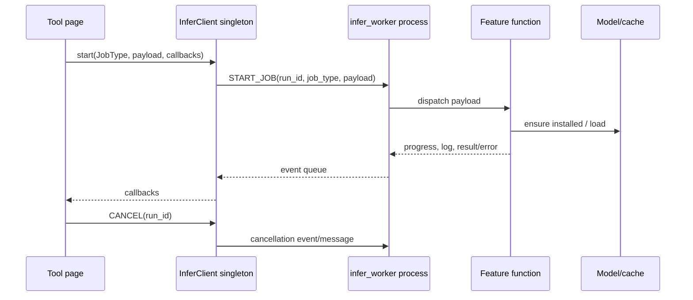

# Stage 06 — AI Pipeline Architecture

Baseline: `main` at `c7aa179`. This is a read-only assessment of the pre-implementation tree.

## Executive finding

Midgard already has the right coarse runtime shape: a PySide6 process owns one persistent inference subprocess and a GUI-side busy gate prevents concurrent GPU work. The protocol and model-specific worker functions are usable foundations. The main weakness is that jobs are dictionaries with implicit schemas and each page independently owns progress, output, cancellation, and temporary-file behavior. Subtitle removal additionally routes through the 550-line `SubtitleRemover` god class.

## Verified current flow



- `gui.py:116-144` connects page `processing_changed` signals into a process-wide GPU busy gate.
- `backend/tools/infer_protocol.py:10-43` defines seven job types and command/event enums.
- `backend/tools/infer_client.py` owns process creation, event polling, watchdog handling, cancellation, idle model release, restart, and shutdown.
- `backend/tools/infer_worker.py` lazily imports feature dependencies inside job functions, which limits parent-process import cost.
- `backend/tools/job_config.py:17-77` snapshots mutable GUI settings into subtitle jobs, but other jobs still use individually assembled payloads.
- `backend/main.py:39-550` owns subtitle media opening, detection, inpainting, progress, FFmpeg audio work, output, and cleanup.

## Feature traces

| Feature | Validation/preprocess | Model/inference | Output/cleanup | Main gaps |
|---|---|---|---|---|
| Remove Text | UI selects media/areas; worker constructs `SubtitleRemover` | OCR plus STTN/LaMa/ProPainter/OpenCV | temporary MP4, FFmpeg audio merge | invalid FPS/dimensions validated late; output and temp ownership mixed |
| Remove Background | page creates temp PNG and payload | `bg_remove`/rembg; optional selection and enhancement | PNG result returned by path | page-owned temporary files; implicit option schema |
| Image Upscale | Pillow input, `EnhanceOptions.from_payload` | Real-ESRGAN and optional denoise | PNG | install can happen inside job; phase progress is synthetic |
| Low Light | dimensions preflighted | MIRNet | PNG | multiple Pillow opens; no shared output contract |
| Select Object | image/point/text payload | Grounding DINO + SAM2 | mask/preview path | model pair compatibility encoded outside protocol |
| Generate Image | prompt/model checks; CUDA gate | Diffusers pipeline | PNG | CUDA-only policy embedded in job; dimensions/steps weakly typed |

## Protocol and lifecycle risks

1. **High — implicit payload schema.** `start_job()` accepts `Dict[str, Any]`; missing and mistyped fields fail in the child after dispatch.
2. **High — job-state fragmentation.** There is no shared queued/preparing/loading/postprocessing/saving state, only log strings and integer progress.
3. **High — cleanup ownership.** UI pages, worker functions, `SubtitleRemover`, and OS temp directories each create artifacts. There is no job workspace manifest.
4. **High — subtitle resource lifetime.** Capture, writer, temporary video, audio temp, and model state span a large class with broad exceptions.
5. **Medium — cancellation latency.** Cancellation is cooperative. Framework calls, downloads, FFmpeg waits, and model loads can remain uninterruptible.
6. **Medium — stale configuration.** Snapshotting is implemented for subtitle jobs, but not through one versioned snapshot type.
7. **Medium — progress semantics.** Percentage ranges are hand-partitioned per feature and do not communicate phases.
8. **Medium — crash ambiguity.** A worker death creates a synthetic crash event, but partial output/workspace disposition is not part of the result.
9. **Low — serialization.** Path-based IPC is appropriate, but arbitrary dictionaries make forward/backward compatibility unverifiable.

## Target architecture

```text
PySide6 GUI
  -> application use cases
  -> typed JobRequest / JobStatus / JobResult
  -> single-job scheduler and GPU busy lease
  -> feature pipeline
  -> model manager
  -> framework adapter
  -> CUDA / DirectML / MPS / ONNX / CPU
```

Keep the single worker. It reduces simultaneous model residency and is consistent with the current busy gate. Add queue visibility before adding parallel execution. CPU-only lightweight tasks may be split later only after measurement.

## Typed job contract

- `job_id: UUID`, `protocol_version: int`, `task: JobType`
- immutable input references and validated model-specific settings
- a worker-safe configuration/hardware snapshot
- `JobPhase`, phase and overall percentages, monotonic timestamps
- cancellation acknowledgement and `cancel_safe` state
- `JobResult(output_paths, warnings, timings, metrics)`
- `JobError(code, user_message, detail, retryable, actions)`
- workspace identity and cleanup disposition
- safe memory metrics: sampled RAM/VRAM totals, never secrets or arbitrary environment data

Unknown fields must be ignored only across a documented protocol-version rule; missing required fields fail in the parent before process submission.

## Failure policy

- Validation and compatibility failures: reject before enqueue; do not start the worker.
- Missing model: expose `NOT_INSTALLED` and offer installation; never surprise-download in a processing phase.
- OOM: preserve current bounded retry, emit a warning and effective setting, then fail with actionable guidance.
- Worker crash: mark active job failed, quarantine partial output, restart once, and require explicit retry.
- Cancellation: acknowledge quickly, stop at the next safe boundary, remove disposable workspace content, retain diagnostic metadata.
- Output failure: never overwrite the source; write to a sibling temporary name and atomically promote.

## Incremental migration

1. Characterize protocol, cancellation, and crash behavior.
2. Add typed dataclasses that serialize to the existing tuple/dict wire format.
3. Add shared phases and a job-status model without changing worker transport.
4. Introduce a per-job temporary workspace.
5. Extract output paths, media lifetime, progress, model selection, and subtitle orchestration from `backend/main.py`.
6. Validate every request in the GUI process.
7. Add visible queue/history UI; retain one GPU job at a time.

## Tests

- protocol round trip and invalid payloads;
- one terminal event per run;
- cancel before start, during load, inference, encoding, and save;
- worker crash/restart and stale-event rejection;
- OOM retry bounds;
- no model/network access in standard tests;
- workspace cleanup and partial-output quarantine;
- CPU/CUDA/DirectML/MPS policy snapshots.

## Files inspected

`gui.py`, `backend/main.py`, `backend/tools/infer_protocol.py`, `infer_client.py`, `infer_worker.py`, `job_config.py`, `video_io.py`, `vram_budget.py`, feature pages, model helpers.

## Unresolved runtime questions

Actual cancellation latency inside each framework, peak IPC/event backlog, Windows FFmpeg file-lock behavior, and worker restart behavior after native crashes require manual/runtime measurement.

Recommended next stage: Python architecture review, then safety tests before protocol changes.
