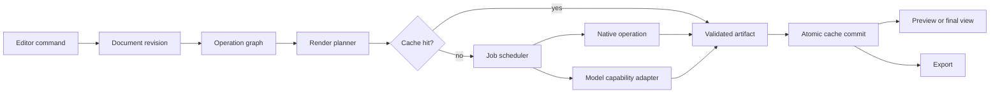

# Target architecture

## Package boundaries

The target layout is additive. Existing modules become adapters until migrated.

```text
backend/
  editor/
    commands.py          # validated user intentions
    document.py          # immutable project state + revisions
    graph.py             # operation DAG and dependency validation
    render_plan.py       # ROI/tile/proxy/full execution planning
    buffers.py           # pixels, alpha, color, depth, flow, masks
    operations/          # deterministic operation implementations
  projects/
    schema.py            # versioned manifest types
    package.py           # safe open/save and asset addressing
    journal.py           # autosave/recovery transaction log
    migrations/          # explicit N -> N+1 migrations
  jobs/
    scheduler.py         # priority, pause/resume/cancel/reorder
    checkpoint.py        # durable chunk/tile checkpoints
    estimator.py         # time and memory estimation
  pipelines/
    image/               # image render orchestration
    video/               # scenes, temporal state, chunks, mux
  capabilities/
    contracts.py         # segment, mat, inpaint, track, restore...
    registry.py          # model/native providers and availability
  codecs/
    probe.py             # FFmpeg capability probing
    profiles.py          # validated export profiles
ui/
  editor/
    document_controller.py
    canvas/
    masks/
    layers/
    properties/
    history/
    comparison/
    timeline/
```

## Data flow



## State ownership

- The document owns operation order, parameters, layer/mask references, selections,
  timeline edits, and version branches.
- The asset store owns immutable source and generated candidate blobs by hash.
- The cache owns reproducible intermediates and may be deleted.
- The journal owns recovery events until folded into a project snapshot.
- The scheduler owns runtime state only. Durable checkpoints make runtime state
  reconstructable.
- UI widgets own transient interaction state only (hover, an unfinished lasso,
  viewport zoom). Accepted edits become commands immediately.

## Core buffer contract

Every render input/output uses a typed descriptor:

```python
MediaBuffer(
    kind="rgba" | "mask" | "depth" | "flow" | "normal",
    shape=(height, width, channels),
    dtype="uint8" | "uint16" | "float16" | "float32",
    color_space="srgb" | "display-p3" | "rec709" | "rec2020" | "acescg",
    transfer="linear" | "srgb" | "gamma24" | "pq" | "hlg",
    alpha_mode="none" | "straight" | "premultiplied",
    frame_time=None | RationalTime,
    transform_to_source=Matrix3x3,
)
```

Operations declare accepted descriptors. The planner inserts explicit conversions;
an operation must not guess channel order, transfer, or alpha mode.

## Public service contracts

- `EditorCommand.apply(document) -> DocumentRevision`
- `Operation.validate(context) -> ValidationReport`
- `RenderPlanner.plan(revision, target, profile) -> RenderPlan`
- `CapabilityProvider.run(request, cancellation, progress) -> ArtifactSet`
- `CheckpointStore.commit(unit_id, artifact_hash, metrics)`
- `Exporter.validate(profile, source) -> ExportReport`

All boundaries return structured errors with a stable code, user-safe message,
retryability, and suggested actions.

## Architectural gates

1. No operation reads UI widgets or global settings directly.
2. No worker writes the final destination directly; it writes a validated staging
   artifact that the parent atomically publishes.
3. No cache entry is trusted without descriptor and content-hash validation.
4. No model path is hard-coded in an editor node.
5. No project package loads pickle or follows untrusted paths.
6. No video encoder profile is shown until FFmpeg probing confirms it.
