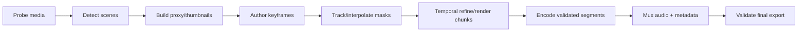

# Video editor implementation

## Principles

Video is not “run the image function independently on every frame.” The document
uses presentation timestamps, scenes, keyframes, temporal masks, flow/tracks, and
chunk checkpoints. Source audio and video metadata remain immutable assets.

## Workspace

```text
player: original | processed | side-by-side | alpha/mask overlay
timeline:
  video track + frame thumbnails + scene boundaries
  mask tracks + correction keyframes + interpolation confidence
  operation/effect tracks + selected preview range
jobs:
  proxy render + final chunks + export/mux progress
```

Timeline time is rational/PTS-based, not `frame_index / rounded_fps`. Variable frame
rate is preserved or deliberately converted by an explicit export setting.

## Pipeline



## Documents

- [Timeline, temporal masks, and background removal](timeline-temporal-masks.md)
- [Processing pipeline, codecs, and export](pipeline-codecs-export.md)
- Performance, cache, cancellation, and recovery use the shared
  [jobs architecture](../architecture/jobs-cache-recovery.md).

## Video operation contract

In addition to image operation fields, a video node declares:

- frame-local, temporal-window, recurrent, or whole-scene state;
- required past/future context in frames or duration;
- reset behavior at scene cuts;
- supported frame rates, dimensions, color, alpha, and proxy scale;
- checkpoint serialization compatibility;
- audio behavior (`copy`, `transform`, `drop`, `unaffected`);
- determinism and cross-chunk seam behavior.

## Vertical slices

1. Timeline/proxy playback and selected-range preview.
2. Frame-local background removal with audio-preserving opaque export.
3. Keyframe mask correction and deterministic interpolation.
4. Forward/backward propagation plus temporal mask refinement.
5. Transparent WebM/ProRes 4444 export with capability probing.
6. Temporal upscale and frame interpolation behind model/quality gates.
